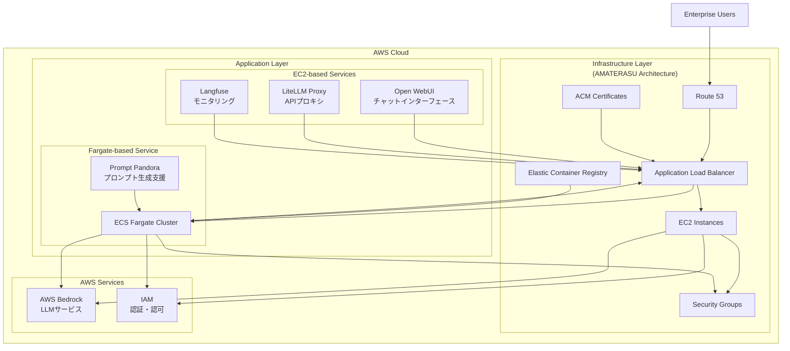

# 🚀 AMATERASU v1.1.0

<p align="center">
  
</p>

<p align="center">
  <a href="https://github.com/Sunwood-ai-labs/AMATERASU"></a>
  <a href="https://github.com/Sunwood-ai-labs/AMATERASU/releases"></a>
  <a href="https://github.com/Sunwood-ai-labs/AMATERASU/blob/main/LICENSE"></a>
</p>

<h2 align="center">エンタープライズグレードのプライベートAIプラットフォーム</h2>

>[!IMPORTANT]
>このリポジトリは[SourceSage](https://github.com/Sunwood-ai-labs/SourceSage)を活用しており、リリースノートやREADME、コミットメッセージの9割は[SourceSage](https://github.com/Sunwood-ai-labs/SourceSage) ＋ [claude.ai](https://claude.ai/)で生成しています。

>[!NOTE]
>AMATERASUは[MOA](https://github.com/Sunwood-ai-labs/MOA)の後継プロジェクトです。各AIサービスを独立したEC2インスタンス上でDocker Composeを用いて実行し、Terraformで簡単にデプロイできるように進化させました。

## 🌟 主な特長

### セキュアな基盤
- AWS Bedrockベースの安全なLLM基盤
- 完全クローズド環境での運用
- エンタープライズグレードのセキュリティ

### マイクロサービスアーキテクチャ
- 独立したサービスコンポーネント
- コンテナベースのデプロイメント
- 柔軟なスケーリング

### Infrastructure as Code
- Terraformによる完全自動化されたデプロイ
- 環境ごとの設定管理
- バージョン管理された構成

## 🏗 システムアーキテクチャ



## 📦 コンポーネント構成

### 1. Open WebUI (フロントエンド)
- チャットベースのユーザーインターフェース
- レスポンシブデザイン
- プロンプトテンプレート管理

### 2. LiteLLM (APIプロキシ)
- Claude-3系列モデルへの統一的なアクセス
- APIキー管理
- レート制限と負荷分散

### 3. Langfuse (モニタリング)
- 使用状況の追跡
- コスト分析
- パフォーマンスモニタリング

### 4. FG-prompt-pandora (Fargate版サンプルアプリケーション)
- AWS Fargateでの自動スケーリング
- Claude-3.5-Sonnetを活用したプロンプト生成
- Streamlitベースの直感的UI
- シンプルなDockerイメージによる容易なデプロイ
- AMATERASU環境への統合サンプル

## 🛠 デプロイメントガイド

### 前提条件
- AWS アカウント
- Terraform >= 0.12
- Docker & Docker Compose
- AWS CLI configured

### セットアップ手順

1. リポジトリのクローン
```bash
git clone https://github.com/Sunwood-ai-labs/AMATERASU.git
cd AMATERASU
```

2. 環境変数の設定
```bash
cp .env.example .env
# Edit .env with your configuration
```

3. インフラのデプロイ
```bash
cd spellbook/base-infrastructure
terraform init && terraform apply

cd ../open-webui/terraform/main-infrastructure
terraform init && terraform apply

cd ../../litellm/terraform/main-infrastructure
terraform init && terraform apply

cd ../../langfuse/terraform/main-infrastructure
terraform init && terraform apply
```

4. サービスの起動
```bash
# Langfuse
cd ../../../langfuse
docker-compose up -d

# LiteLLM
cd ../litellm
docker-compose up -d

# Open WebUI
cd ../open-webui
docker-compose up -d

# FG-prompt-pandora
cd ../FG-prompt-pandora
docker-compose up -d
```

## 📈 運用管理

### モニタリング
- Prometheusによるメトリクス収集
- Langfuseでの使用状況分析
- CloudWatchによるリソースモニタリング

### スケジューリング
- 平日8:00-22:00の自動起動/停止
- 需要に応じた手動スケーリング
- バッチジョブのスケジューリング

### セキュリティ
- IPホワイトリスト制御
- TLS/SSL暗号化
- IAMロールベースのアクセス制御

## 💡 ユースケース

### プロンプトエンジニアリング支援
- タスク記述からの最適なプロンプト生成
- 既存プロンプトの改善提案
- プロンプトテンプレートの管理と共有
- チーム全体でのプロンプト品質の標準化

### LLMアプリケーション開発
- APIプロキシを介した安全なモデルアクセス
- 使用状況の可視化と分析
- コスト管理とリソース最適化
- セキュアな開発環境の提供

## 🆕 最新のアップデート (v1.1.0)

- 🎉 **FG-prompt-pandoraモジュールを追加**: AWS Fargate上で動作するプロンプト生成支援ツール。Claude-3.5-SonnetモデルとStreamlit UIを使用し、Docker ComposeとTerraformで容易にデプロイできます。AWS Fargateによる自動スケーリングに対応。
- 🚀 README.mdを全面的に改修し、可読性を向上。見出しの見直し、箇条書きの追加、表現の簡素化、システムアーキテクチャ図のmermaid記法への書き直し、各機能の説明の詳細化と利用シーンの具体化、セキュリティに関する記述の強化を行いました。
- 🚀 英語READMEを更新。最新の情報を反映しました。
- 🚀 リリースノートと関連ファイルのバージョン番号をv1.1.0に更新。
- 🚀 ドキュメント生成用モデルを`gemini/gemini-1.5-flash`から`gemini/gemini-exp-1121`に更新。
- 🚀 Docker Composeファイルに`restart: always`オプションを追加。サービスの自動再起動を実現します。


## 📝 ライセンス

このプロジェクトはMITライセンスの下で公開されています。詳細は[LICENSE](LICENSE)ファイルをご参照ください。

## 🤝 コントリビューション

1. このリポジトリをフォーク
2. フィーチャーブランチを作成 (`git checkout -b feature/amazing-feature`)
3. 変更をコミット (`git commit -m 'Add amazing feature'`)
4. ブランチをプッシュ (`git push origin feature/amazing-feature`)
5. プルリクエストを作成

## 📞 サポート

不明点やフィードバックがありましたら、以下までお気軽にご連絡ください：
- GitHub Issues: [Issues](https://github.com/Sunwood-ai-labs/AMATERASU/issues)
- Email: support@sunwoodai.com

## 👥 謝辞

iris-s-coon氏とMaki氏の貢献に感謝いたします。

---

AMATERASUで、エンタープライズグレードのAIプラットフォームを構築しましょう。✨