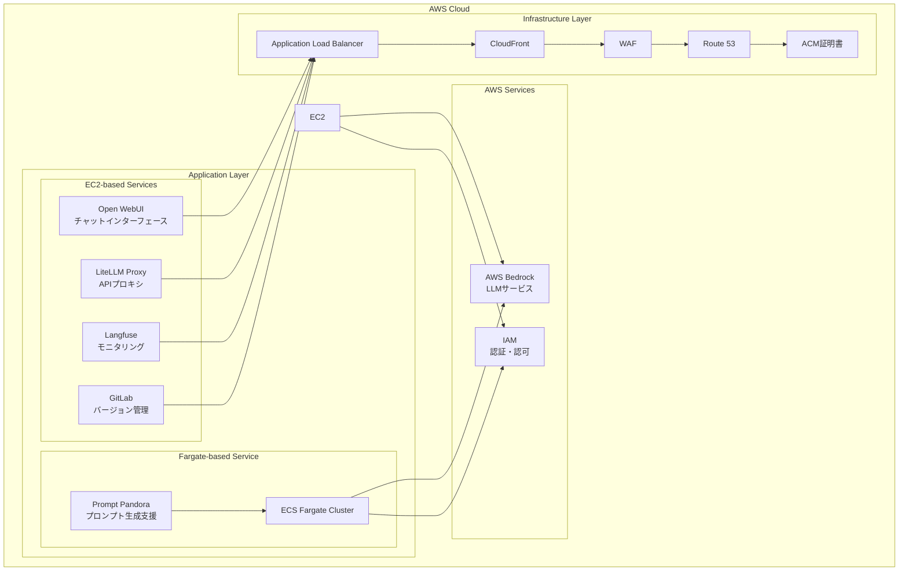

# 日本語版 README

  

  
  
  

<h2 align="center">エンタープライズグレードのプライベートAIプラットフォーム (v1.8.0)</h2>

>[!IMPORTANT]
>このリポジトリは[SourceSage](https://github.com/Sunwood-ai-labs/SourceSage)を活用しており、リリースノートやREADME、コミットメッセージの9割は[SourceSage](https://github.com/Sunwood-ai-labs/SourceSage) ＋ [claude.ai](https://claude.ai/)で生成しています。

>[!NOTE]
>AMATERASUは[MOA](https://github.com/Sunwood-ai-labs/MOA)の後継プロジェクトです。各AIサービスを独立したEC2インスタンス上でDocker Composeを用いて実行し、Terraformで簡単にデプロイできるように進化させました。

## 🚀 プロジェクト概要

AMATERASUは、エンタープライズグレードのプライベートAIプラットフォームです。AWS BedrockとGoogle Vertex AIをベースに構築されており、セキュアでスケーラブルな環境でLLMを活用したアプリケーションを開発・運用できます。GitLabとの統合により、バージョン管理、CI/CDパイプライン、プロジェクト管理を効率化します。

## ✨ 主な機能

### セキュアな基盤
- AWS BedrockとGoogle Vertex AIベースの安全なLLM基盤
- 完全クローズド環境での運用
- エンタープライズグレードのセキュリティ

### マイクロサービスアーキテクチャ
- 独立したサービスコンポーネント
- コンテナベースのデプロイメント
- 柔軟なスケーリング

### Infrastructure as Code
- Terraformによる完全自動化されたデプロイ
- 環境ごとの設定管理
- バージョン管理された構成

### GitLab統合
- バージョン管理、CI/CDパイプライン、プロジェクト管理機能の向上
- セルフホスト型GitLabインスタンスの統合
- LLMを用いたマージリクエスト分析
- GitLab Webhookを用いた自動ラベル付け

## 🏗️ システムアーキテクチャ

## 📦 コンポーネント構成

### 1. Open WebUI (フロントエンド)
- チャットベースのユーザーインターフェース
- レスポンシブデザイン
- プロンプトテンプレート管理

### 2. LiteLLM (APIプロキシ)
- Claude-3系列モデルへの統一的なアクセス
- Google Vertex AIモデルへのアクセス
- APIキー管理とレート制限

### 3. Langfuse (モニタリング)
- 使用状況の追跡
- コスト分析
- パフォーマンスモニタリング

### 4. GitLab (バージョン管理)
- セルフホストGitLabインスタンス
- プロジェクトとコード管理
- CIパイプラインとRunner設定
- バックアップと復元機能

### 5. FG-prompt-pandora (Fargate版サンプルアプリケーション)
- AWS Fargateでの自動スケーリング
- Claude-3.5-Sonnetを活用したプロンプト生成
- Streamlitベースの直感的UI

## 🆕 最新情報

### AMATERASU v1.8.0 (最新のリリース)

- 🎉 **CloudFrontとWAFの導入によるセキュリティ強化**
  - CloudFrontディストリビューションの追加
  - WAFによるIPベースのアクセス制御
  - インフラストラクチャのセキュリティ向上
  
- 🎉 **Route53とACM設定の改善**
  - DNSレコード管理の改善
  - SSL/TLS証明書の自動管理
  - ドメイン設定の柔軟性向上

- 🚀 **インフラストラクチャの最適化**
  - CloudFrontを介したコンテンツ配信の効率化
  - WAFルールセットの柔軟な設定オプション
  - セキュリティグループ設定の更新

[その他の詳細はリリースノートを参照]

## 📄 ライセンス

このプロジェクトはMITライセンスの下で公開されています。

## 👏 謝辞

コントリビューターの皆様に感謝いたします。
