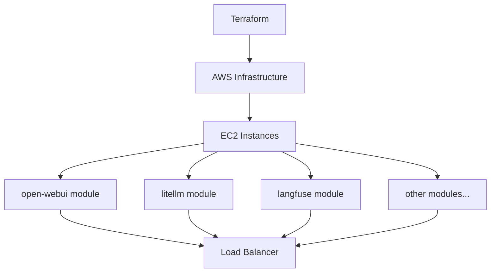

<p align="center">

<h1 align="center">🌄 AMATERASU 🌄</h1>
</p>

<p align="center">
  <a href="https://github.com/Sunwood-ai-labs/AMATERASU">
    
  </a>
  <a href="https://github.com/Sunwood-ai-labs/AMATERASU/releases">
    
  </a>
  <a href="https://github.com/Sunwood-ai-labs/AMATERASU/blob/main/LICENSE">
    
  </a>
  <a href="https://github.com/Sunwood-ai-labs/AMATERASU/stargazers">
    
  </a>
</p>

<h2 align="center">
  ～ AWS上のLLMプラットフォームを自動構築 ～
</h2>

>[!IMPORTANT]
>AMATERASUは[MOA](https://github.com/Sunwood-ai-labs/MOA)の後継プロジェクトです。各AIサービスをAWS EC2上の独立したモジュールとして再構築し、Terraformを用いて簡単にデプロイできるように進化させました。

## 🌟 はじめに

AMATERASUは、AWS上にLLM（大規模言語モデル）プラットフォームを構築するための自動化ツールです。MOAの機能を踏襲しながら、より柔軟なインフラストラクチャの構築と管理を実現します。

主な特徴:
- Terraformを使用した簡単なAWSリソース管理
- マイクロサービスアーキテクチャの採用による柔軟な拡張性
- EC2インスタンス上での各種AIサービスの分離デプロイ
- 高度なセキュリティと運用管理機能

## 🚀 アーキテクチャ



## 🛠️ システム要件

- AWS アカウント
- Terraform がインストールされた環境
- Docker と Docker Compose
- AWS CLI（設定済み）

## 📦 インストール手順

1. リポジトリのクローン:
```bash
git clone https://github.com/Sunwood-ai-labs/AMATERASU.git
cd AMATERASU
```

2. 環境変数の設定:
```bash
cp .env.example .env
# .envファイルを編集して必要な認証情報を設定
```

3. Terraformの初期化:
```bash
cd terraform
terraform init
```

4. インフラストラクチャのデプロイ:
```bash
terraform plan
terraform apply
```

## 🌐 モジュール構成

各モジュールは独立したEC2インスタンス上で動作し、必要に応じて選択的にデプロイできます：

### open-webui モジュール
- チャットインターフェース提供
- LLMモデルの管理と実行
```bash
terraform apply -target=module.open_webui
```

### litellm モジュール
- 複数のLLMプロバイダーの統合
- API管理とルーティング
```bash
terraform apply -target=module.litellm
```

### langfuse モジュール
- LLMの実行ログ収集
- パフォーマンスモニタリング
```bash
terraform apply -target=module.langfuse
```

## 📊 モニタリングとメンテナンス

- CloudWatchによる各モジュールのメトリクス監視
- 自動バックアップと復元機能
- スケーリングポリシーの設定

## 🔒 セキュリティ機能

- VPC内での分離されたネットワーク構成
- IAMロールによる権限管理
- SSL/TLS証明書の自動管理
- セキュリティグループの細かな制御

## 💻 運用コマンド例

モジュールの起動:
```bash
./scripts/start-module.sh open-webui
```

ログの確認:
```bash
./scripts/view-logs.sh litellm
```

設定の更新:
```bash
./scripts/update-config.sh langfuse
```

## 📚 ドキュメント

詳細なドキュメントは以下のディレクトリに格納されています：

```plaintext
docs/
├── setup/           # セットアップガイド
├── modules/         # 各モジュールの詳細説明
├── operations/      # 運用マニュアル
└── security/        # セキュリティガイドライン
```

## 🤝 コントリビューション

コントリビューションを歓迎します！以下の手順で参加できます：

1. このリポジトリをフォーク
2. 新しいブランチを作成 (`git checkout -b feature/amazing-feature`)
3. 変更をコミット (`git commit -m 'Add amazing feature'`)
4. ブランチをプッシュ (`git push origin feature/amazing-feature`)
5. プルリクエストを作成

## 📄 ライセンス

このプロジェクトはMITライセンスの下で公開されています。詳細は[LICENSE](LICENSE)ファイルをご覧ください。

## 🌟 謝辞

AMATERASUは以下のプロジェクトの支援を受けています：

- [MOA](https://github.com/Sunwood-ai-labs/MOA) - 基盤となるプロジェクト
- [open-webui](https://github.com/open-webui/open-webui)
- [litellm](https://github.com/BerriAI/litellm)
- [langfuse](https://github.com/langfuse/langfuse)
- [Terraform](https://www.terraform.io/)

## 📧 サポート

ご質問やフィードバックがありましたら、以下までお気軽にご連絡ください：
- Issue作成: [GitHub Issues](https://github.com/Sunwood-ai-labs/AMATERASU/issues)
- メール: support@sunwoodai.com

AMATERASUで、より柔軟で強力なAIインフラストラクチャを構築しましょう！ ✨
