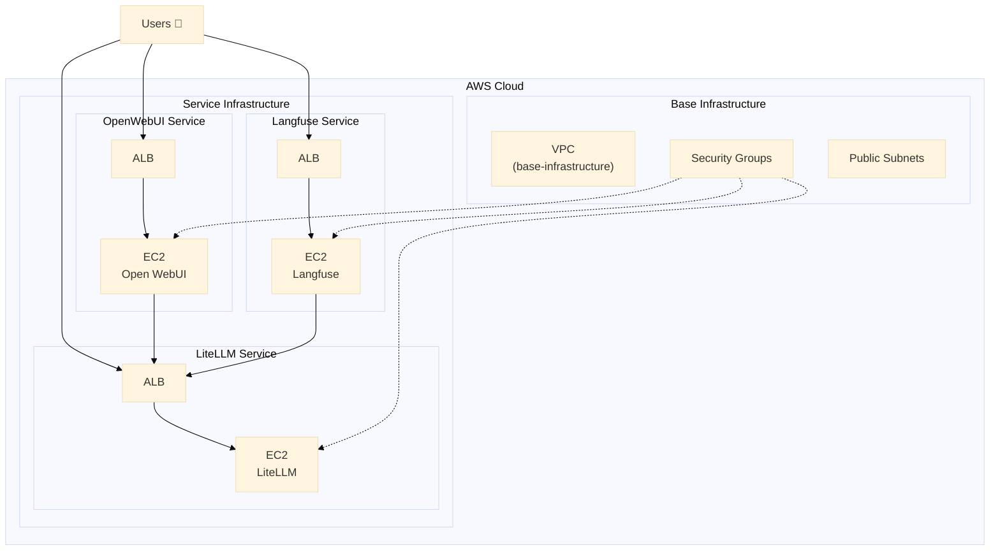

<p align="center">

<h1 align="center">🌄 AMATERASU v0.6.0 🌄</h1>
</p>

<p align="center">
  <a href="https://github.com/Sunwood-ai-labs/AMATERASU">
    
  </a>
  <a href="https://github.com/Sunwood-ai-labs/AMATERASU/releases">
    
  </a>
  <a href="https://github.com/Sunwood-ai-labs/AMATERASU/blob/main/LICENSE">
    
  </a>
  <a href="https://github.com/Sunwood-ai-labs/AMATERASU/stargazers">
    
  </a>
</p>

<h2 align="center">
  ～ AWS上のLLMプラットフォームを自動構築 ～
</h2>

>[!IMPORTANT]
>このリポジトリは[SourceSage](https://github.com/Sunwood-ai-labs/SourceSage)を活用しており、リリースノートやREADME、コミットメッセージの9割は[SourceSage](https://github.com/Sunwood-ai-labs/SourceSage) ＋ [claude.ai](https://claude.ai/)で生成しています。

>[!NOTE]
>AMATERASUは[MOA](https://github.com/Sunwood-ai-labs/MOA)の後継プロジェクトです。各AIサービスを独立したEC2インスタンス上でDocker Composeを用いて実行し、Terraformで簡単にデプロイできるように進化させました。

## 🚀 プロジェクト概要

AMATERASUは、AWS上にLLM（大規模言語モデル）プラットフォームを構築するための自動化ツールです。MOAの機能を踏襲しながら、各サービスを独立したEC2インスタンスで運用することで、より柔軟なスケーリングと管理を実現します。

### 主な特徴:
- Terraformを使用した簡単なEC2インスタンス管理
- 各サービスごとに独立したEC2インスタンスとDocker Compose環境
- サービス単位でのスケーリングと運用が可能
- セキュアな通信とアクセス制御

## 🏗️ アーキテクチャ

### アーキテクチャ概要

AMATERASUは3層アーキテクチャで構成されています：

1. **インフラ層** (Spellbook)
   - AWS基盤インフラストラクチャ
   - ネットワーキングとセキュリティ
   
2. **プラットフォーム層**
   - LLMプロキシサービス (LiteLLM)
   - モニタリング基盤 (Langfuse)
   
3. **アプリケーション層**
   - WebUIインターフェース (Open WebUI)
   - APIエンドポイント

### インフラストラクチャ構成図



## 📦 インストール手順

1. リポジトリのクローン:
```bash
git clone https://github.com/Sunwood-ai-labs/AMATERASU.git
cd AMATERASU
```

2. 環境変数の設定:
```bash
cp .env.example .env
# .envファイルを編集して必要な認証情報を設定
```

3. インフラのデプロイ:  (CloudFront関連は削除済みです。)
```bash
cd spellbook/base-infrastructure
terraform init && terraform apply

cd ../open-webui/terraform/main-infrastructure
terraform init && terraform apply
```

4. サービスの起動:
```bash
# Langfuseのデプロイ
cd ../../langfuse
docker-compose up -d

# LiteLLMのデプロイ
cd ../litellm
docker-compose up -d

# Open WebUIのデプロイ
cd ../open-webui
docker-compose up -d
```

## 📚 詳細ドキュメント

- [Spellbook インフラ構築ガイド](spellbook/README.md)
- [LiteLLM 設定ガイド](spellbook/litellm/README.md)
- [Langfuse セットアップガイド](spellbook/langfuse/README.md)

## 🆕 最新情報

### v0.6.0 の更新内容

- CloudFrontインフラの削除に伴い、不要になったリソースを削除しました。
- コードを簡素化し、保守性を向上させました。
- アプリケーションのHTTPSとHTTP URLを出力に追加しました。
- 環境変数ファイルとセットアップスクリプトのパスを`terraform.tfvars`で容易に変更できるようにしました。
- 不要な変数定義を削除しました。
- セットアップスクリプトを簡素化しました。


## 📊 リソース要件

最小構成：
- EC2: t3.medium (2vCPU/4GB)
- Storage: 50GB gp2
- Network: パブリックサブネット

推奨構成：
- EC2: t3.large (2vCPU/8GB)
- Storage: 100GB gp2
- Network: パブリック/プライベートサブネット

## 💰 コスト管理

Langfuseによる詳細なコスト分析と管理機能を提供：
- モデルごとの利用コスト追跡
- 予算アラートの設定
- 使用量の可視化

## 👏 謝辞

Makiへの貢献に感謝します。

## 📄 ライセンス

このプロジェクトはMITライセンスの下で公開されています。詳細は[LICENSE](LICENSE)ファイルをご覧ください。

## 🤝 コントリビューション

1. このリポジトリをフォーク
2. 新しいブランチを作成 (`git checkout -b feature/amazing-feature`)
3. 変更をコミット (`git commit -m 'Add amazing feature'`)
4. ブランチをプッシュ (`git push origin feature/amazing-feature`)
5. プルリクエストを作成

## 📧 サポート

ご質問やフィードバックがありましたら、以下までお気軽にご連絡ください：
- Issue作成: [GitHub Issues](https://github.com/Sunwood-ai-labs/AMATERASU/issues)
- メール: support@sunwoodai.com

AMATERASUで、より柔軟で強力なAIインフラストラクチャを構築しましょう！ ✨