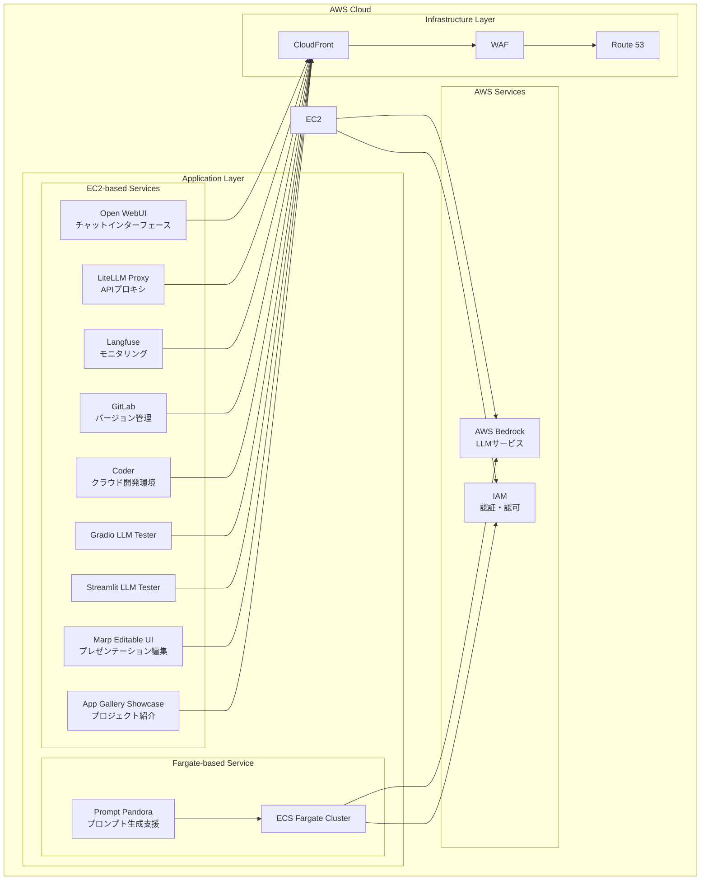

<p align="center">
  
</p>

<p align="center">
  <a href="https://github.com/Sunwood-ai-labs/AMATERASU"></a>
  <a href="https://github.com/Sunwood-ai-labs/AMATERASU/releases"></a>
  <a href="https://github.com/Sunwood-ai-labs/AMATERASU/blob/main/LICENSE"></a>
</p>

<h2 align="center">エンタープライズグレードのプライベートAIプラットフォーム (🚀 AMATERASU v1.22.0)</h2>

>[!IMPORTANT]
>このリポジトリは[SourceSage](https://github.com/Sunwood-ai-labs/SourceSage)を活用しており、リリースノートやREADME、コミットメッセージの9割は[SourceSage](https://github.com/Sunwood-ai-labs/SourceSage) ＋ [claude.ai](https://claude.ai/)で生成しています。

>[!NOTE]
>AMATERASUは[MOA](https://github.com/Sunwood-ai-labs/MOA)の後継プロジェクトです。各AIサービスを独立したEC2インスタンス上でDocker Composeを用いて実行し、Terraformで簡単にデプロイできるように進化させました。

## 🚀 プロジェクト概要

AMATERASUは、エンタープライズグレードのプライベートAIプラットフォームです。AWS BedrockとGoogle Vertex AIをベースに構築されており、セキュアでスケーラブルな環境でLLMを活用したアプリケーションを開発・運用できます。GitLabとの統合により、バージョン管理、CI/CDパイプライン、プロジェクト管理を効率化します。このリポジトリは、複数のAI関連プロジェクトを管理するための「呪文書（Spellbook）」として構成されています。各プロジェクトは、特定のAIサービスや機能をデプロイ・管理するための独立したフォルダとして構造化されています。


## ✨ 主な機能

### セキュアな基盤
- AWS BedrockとGoogle Vertex AIベースの安全なLLM基盤
- 完全クローズド環境での運用
- エンタープライズグレードのセキュリティ

### マイクロサービスアーキテクチャ
- 独立したサービスコンポーネント
- コンテナベースのデプロイメント
- 柔軟なスケーリング

### Infrastructure as Code
- Terraformによる完全自動化されたデプロイ
- 環境ごとの設定管理
- バージョン管理された構成

### GitLab統合
- バージョン管理、CI/CDパイプライン、プロジェクト管理機能の向上
- セルフホスト型GitLabインスタンスの統合
- LLMを用いたマージリクエスト分析
- GitLab Webhookを用いた自動ラベル付け

### プロジェクト探索機能
- Terraformプロジェクトの自動検出と`terraform.tfvars`ファイルの生成
- `amaterasu`コマンドラインツールによる簡素化された設定


## 🏗️ システムアーキテクチャ



## 📦 コンポーネント構成

### 1. Open WebUI (フロントエンド)
- チャットベースのユーザーインターフェース
- レスポンシブデザイン
- プロンプトテンプレート管理
    - [詳細はこちら](./spellbook/open-webui/README.md)

### 2. LiteLLM (APIプロキシ)
- Claude-3系列モデルへの統一的なアクセス
- Google Vertex AIモデルへのアクセス
- OpenRouter API統合
- APIキー管理とレート制限
    - [詳細はこちら](./spellbook/litellm/README.md)

### 3. Langfuse (モニタリング)
- 使用状況の追跡
- コスト分析
- パフォーマンスモニタリング
    - [詳細はこちら](./spellbook/langfuse3/README.md)

### 4. GitLab (バージョン管理)
- セルフホストGitLabインスタンス
- プロジェクトとコード管理
- CIパイプラインとRunner設定
- バックアップと復元機能

### 5. FG-prompt-pandora (Fargate版サンプルアプリケーション)
- AWS Fargateでの自動スケーリング
- Claude-3.5-Sonnetを活用したプロンプト生成
- Streamlitベースの直感的UI
    - [詳細はこちら](./spellbook/fg-prompt-pandora/README.md)

### 6. Coder (クラウド開発環境)
- WebベースのIDE環境
- VS Code拡張機能のサポート
- AWSインフラストラクチャ上でのセキュアな開発
    - [詳細はこちら](./spellbook/Coder/README.md)

### 7. Dify (AIアプリケーション開発プラットフォーム)
- 様々なAIモデルを統合したアプリケーション開発プラットフォーム
- UI/APIベースの開発が可能
    - [詳細はこちら](./spellbook/dify/README.md)

### 8. Dify Beta (AIアプリケーション開発プラットフォーム)
- 新機能と実験的な機能を含むDifyのベータ版
- ベクトルデータベースとサンドボックス環境の高度な設定が可能
    - [詳細はこちら](./spellbook/dify-beta1/README.md)

### 9. Open WebUI Pipeline
- Open WebUIとの連携を強化するパイプライン機能
- 会話ターン制限やLangfuse連携などのフィルター処理が可能
    - [詳細はこちら](./spellbook/open-webui-pipeline/README.md)

### 10. Amaterasu Tool (Terraform 変数ジェネレーター)
-  コマンドラインツールで`terraform.tfvars`ファイルの生成を自動化
- spellbook の各プロジェクトを対象に設定値を生成
    - [詳細はこちら](./spellbook/amaterasu-tool-ui/README.md)

### 11. Kotaemon (ドキュメントとチャットRAG UIツール)
- ドキュメントとチャットするためのRAG UIツール
- Docker環境とTerraform設定を提供
- データ永続化とカスタマイズ可能な環境設定
- セキュアな認証システムを実装
    - [詳細はこちら](./spellbook/kotaemon/README.md)

### 12. Bolt DIY (AIチャットインターフェース)
- 最新のAIチャットインターフェース
- 複数のAIプロバイダー（OpenAI、Anthropic、Google等）をサポート
- Dockerコンテナ化された環境を提供
- CloudFrontインフラストラクチャの設定
    - [詳細はこちら](./spellbook/bolt-diy/README.md)

### 13.  LLMテスター(Gradio版)
- GradioベースのLLMプロキシ接続テスター
- 各種パラメータ設定とデバッグ情報表示
    - [詳細はこちら](./spellbook/ee-llm-tester-gr/README.md)

### 14. LLMテスター(Streamlit版)
- StreamlitベースのLLMプロキシ接続テスター
- 各種パラメータ設定とデバッグ情報表示
    - [詳細はこちら](./spellbook/ee-llm-tester-st/README.md)

### 15. Marp Editable UI (Markdown プレゼンテーション編集ツール)
- Markdown形式でプレゼンテーションを作成・編集できるWebアプリケーション
- Dockerコンテナ化された環境を提供
    - [詳細はこちら](./spellbook/ee-marp-editable-ui/README.md)

### 16. App Gallery Showcase (プロジェクト紹介Webアプリケーション)
- プロジェクトを視覚的に美しく紹介するWebアプリケーション
- Dockerコンテナ化された環境を提供
    - [詳細はこちら](./spellbook/app-gallery-showcase/README.md)


## 🔧 使用方法

各コンポーネントの使用方法については、それぞれのREADMEファイルを参照してください。  `amaterasu`コマンドラインツールの使用方法については、`spellbook/amaterasu-tool-ui/README.md`を参照ください。


## 📦 インストール手順

1. リポジトリをクローンします。
```bash
git clone https://github.com/Sunwood-ai-labs/AMATERASU.git
cd AMATERASU
```
2. 各プロジェクトのREADMEに記載されている手順に従って、依存関係をインストールし、アプリケーションをデプロイします。
3. `terraform.tfvars`ファイルに必要な設定を入力します。  `amaterasu` ツールを利用して自動生成することもできます。


## 📦 依存関係

このリポジトリのルートディレクトリには、共通の依存関係を定義する`requirements.txt`ファイルがあります。
```bash
pip install -r requirements.txt
```

```plaintext
aira
sourcesage
```

## 📄 ライセンス

このプロジェクトはMITライセンスの下で公開されています。

## 👏 謝辞

iris-s-coonとMakiへの貢献に感謝します。

## 🆕 最新情報

### AMATERASU v1.22.0 (最新のリリース)

- **🔄 OpenRouter API 統合の強化**: LiteLLM の OpenRouter API 統合が強化され、最新バージョンに更新されました。
- **🧪 UI テストツールの機能改善**: ECS インフラストラクチャが EC2 インスタンスベースに最適化され、より安定した運用が可能になりました。
- **📊 Marp Editable UI の追加**: Markdown プレゼンテーション編集環境を提供するコンテナ化された新しいツールが追加されました。
- **🖼️ App Gallery Showcase の統合**: プロジェクトを美しく紹介するウェブアプリケーションが追加されました。
- **🐳 Docker イメージの更新**: Langfuse 3.26 への更新など、複数のコンポーネントが最新バージョンに更新されました。
- **📐 アーキテクチャ可視化の強化**: システム全体のアーキテクチャ図を追加し、コンポーネント間の関係をより明確に示しました。
- **🔍 Open WebUI の RAG 機能強化**: Playwright 統合による Web コンテンツのローディング機能が追加されました。
- 🖥️ ECS タスクのデプロイメントが EC2 インスタンスベースの構成に最適化され、より安定した運用が可能になりました
- 🔗 Docker Compose 設定の改善と標準化により、コンテナ間の連携が強化されました
- 🛡️ WAF 設定のセキュリティ強化と CSV ファイルによる IP ホワイトリスト管理が改善されました
- 📄 各コンポーネントの `.env.example` ファイルを追加し、設定ファイルの標準化と文書化を実施
- 🧩 Terraform モジュールの共有化と再利用性の向上
- 🔤 環境変数の標準化により、異なる環境間での一貫性を確保


- 📝 注意事項:
    - 🔄 LiteLLM の設定変更に伴い、既存の設定ファイルの更新が必要です
    - 📋 WAF の IP ホワイトリストを新しい CSV 形式に移行する必要があります
    - 🔍 環境変数の設定を確認し、必要に応じて更新してください
    - 📚 新規コンポーネントを利用する場合は、それぞれの README を参照して適切に設定してください

このリリースでは、エンタープライズグレードの AI プラットフォームとしての機能が強化され、より安定したインフラストラクチャと拡張された UI ツールを提供します。✨