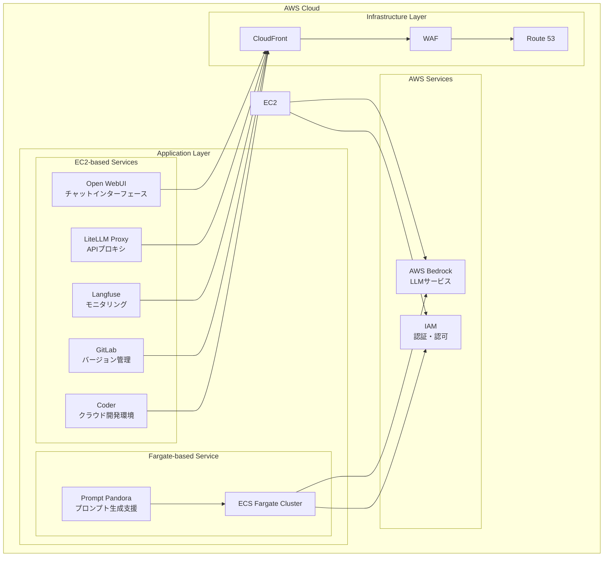

<p align="center">
  
</p>

<p align="center">
  <a href="https://github.com/Sunwood-ai-labs/AMATERASU"></a>
  <a href="https://github.com/Sunwood-ai-labs/AMATERASU/releases"></a>
  <a href="https://github.com/Sunwood-ai-labs/AMATERASU/blob/main/LICENSE"></a>
</p>

<h2 align="center">エンタープライズグレードのプライベートAIプラットフォーム (v1.14.0)</h2>

>[!IMPORTANT]
>このリポジトリは[SourceSage](https://github.com/Sunwood-ai-labs/SourceSage)を活用しており、リリースノートやREADME、コミットメッセージの9割は[SourceSage](https://github.com/Sunwood-ai-labs/SourceSage) ＋ [claude.ai](https://claude.ai/)で生成しています。

>[!NOTE]
>AMATERASUは[MOA](https://github.com/Sunwood-ai-labs/MOA)の後継プロジェクトです。各AIサービスを独立したEC2インスタンス上でDocker Composeを用いて実行し、Terraformで簡単にデプロイできるように進化させました。

## 🚀 プロジェクト概要

AMATERASUは、エンタープライズグレードのプライベートAIプラットフォームです。AWS BedrockとGoogle Vertex AIをベースに構築されており、セキュアでスケーラブルな環境でLLMを活用したアプリケーションを開発・運用できます。GitLabとの統合により、バージョン管理、CI/CDパイプライン、プロジェクト管理を効率化します。  v1.14.0では、AWSインフラストラクチャの構築と管理を簡素化するためのTerraformコードと、CloudFrontインフラストラクチャの構築を容易にするためのモジュールを実装しました。また、セットアップスクリプトと出力値の定義を追加し、Difyのセットアップと運用を改善しています。

このリポジトリは、複数のAI関連プロジェクトを管理するための「呪文書（Spellbook）」として構成されています。各プロジェクトは、特定のAIサービスや機能をデプロイ・管理するための独立したフォルダとして構造化されています。

## ✨ 主な機能

### セキュアな基盤
- AWS BedrockとGoogle Vertex AIベースの安全なLLM基盤
- 完全クローズド環境での運用
- エンタープライズグレードのセキュリティ

### マイクロサービスアーキテクチャ
- 独立したサービスコンポーネント
- コンテナベースのデプロイメント
- 柔軟なスケーリング

### Infrastructure as Code
- Terraformによる完全自動化されたデプロイ
- 環境ごとの設定管理
- バージョン管理された構成

### GitLab統合
- バージョン管理、CI/CDパイプライン、プロジェクト管理機能の向上
- セルフホスト型GitLabインスタンスの統合
- LLMを用いたマージリクエスト分析
- GitLab Webhookを用いた自動ラベル付け

## 🏗️ システムアーキテクチャ



## 📦 コンポーネント構成

### 1. Open WebUI (フロントエンド)
- チャットベースのユーザーインターフェース
- レスポンシブデザイン
- プロンプトテンプレート管理
    - [詳細はこちら](./spellbook/open-webui/README.md)

### 2. LiteLLM (APIプロキシ)
- Claude-3系列モデルへの統一的なアクセス
- Google Vertex AIモデルへのアクセス
- APIキー管理とレート制限
    - [詳細はこちら](./spellbook/litellm/README.md)

### 3. Langfuse (モニタリング)
- 使用状況の追跡
- コスト分析
- パフォーマンスモニタリング
    - [詳細はこちら](./spellbook/langfuse3/README.md)

### 4. GitLab (バージョン管理)
- セルフホストGitLabインスタンス
- プロジェクトとコード管理
- CIパイプラインとRunner設定
- バックアップと復元機能

### 5. FG-prompt-pandora (Fargate版サンプルアプリケーション)
- AWS Fargateでの自動スケーリング
- Claude-3.5-Sonnetを活用したプロンプト生成
- Streamlitベースの直感的UI
    - [詳細はこちら](./spellbook/fg-prompt-pandora/README.md)

### 6. Coder (クラウド開発環境)
- WebベースのIDE環境
- VS Code拡張機能のサポート
- AWSインフラストラクチャ上でのセキュアな開発
    - [詳細はこちら](./spellbook/Coder/README.md)

### 7. Dify (AIアプリケーション開発プラットフォーム)
- 様々なAIモデルを統合したアプリケーション開発プラットフォーム
- UI/APIベースの開発が可能
    - [詳細はこちら](./spellbook/dify/README.md)

### 8. Dify Beta (AIアプリケーション開発プラットフォーム)
- 新機能と実験的な機能を含むDifyのベータ版
- ベクトルデータベースとサンドボックス環境の高度な設定が可能
    - [詳細はこちら](./spellbook/dify-beta1/README.md)

### 9. Open WebUI Pipeline
- Open WebUIとの連携を強化するパイプライン機能
- 会話ターン制限やLangfuse連携などのフィルター処理が可能
    - [詳細はこちら](./spellbook/open-webui-pipeline/README.md)
    
### 10. tfvars_generator (Terraform変数ジェネレーター)
- Terraform変数ファイル(`terraform.tfvars`)を自動生成するWebアプリケーション
- プロジェクト検出、共通設定、個別設定をサポート
    - [詳細はこちら](./spellbook/tfvars_generator/README.md)

## 🆕 最新情報

### AMATERASU v1.14.0 (最新のリリース)

- 🎉 セットアップスクリプトの実装: EC2インスタンス起動後にAMATERASUリポジトリのクローン、環境変数の設定、Docker Composeを使用したアプリケーションの起動を自動化します。
- 🎉 CloudFrontインフラモジュールのTerraform設定: CloudFrontディストリビューション、WAFv2、Route53レコード、ACM証明書を管理するTerraformモジュールを実装しました。
- 🎉 メインインフラ構築のためのTerraformコードを追加: メインのTerraformファイルにIAM、Compute、Networkingモジュールを統合しました。
- 🎉 構築されたインフラに関する出力値を定義: 構築されたインフラストラクチャリソースに関する出力値を定義しました。
- 🎉 CloudFrontインフラのための変数の追加: CloudFrontインフラストラクチャの構成に必要な変数を追加しました。
- 🎉 共通変数ファイルの作成と設定: 全てのインフラリソースで共通して使用する変数を`common_variables.tf`に定義することで、リソース定義のモジュール化と再利用性を向上させました。


## 🛠️ 使用方法

各コンポーネントの使用方法については、それぞれのREADMEファイルを参照してください。  特に、Terraform変数ジェネレーターWebアプリの使用方法については、`spellbook/tfvars_generator/README.md`を参照ください。


## 📦 インストール手順

1. リポジトリをクローンします。
```bash
git clone https://github.com/Sunwood-ai-labs/AMATERASU.git
cd AMATERASU
```
2. 各プロジェクトのREADMEに記載されている手順に従って、依存関係をインストールし、アプリケーションをデプロイします。
3. `terraform.tfvars`ファイルに必要な設定を入力します。

## 📦 依存関係

このリポジトリのルートディレクトリには、共通の依存関係を定義する`requirements.txt`ファイルがあります。
```bash
pip install -r requirements.txt
```

```plaintext
aira
sourcesage
```

## 📄 ライセンス

このプロジェクトはMITライセンスの下で公開されています。

## 👏 謝辞

Maki、iris-s-coonへの貢献に感謝します。
