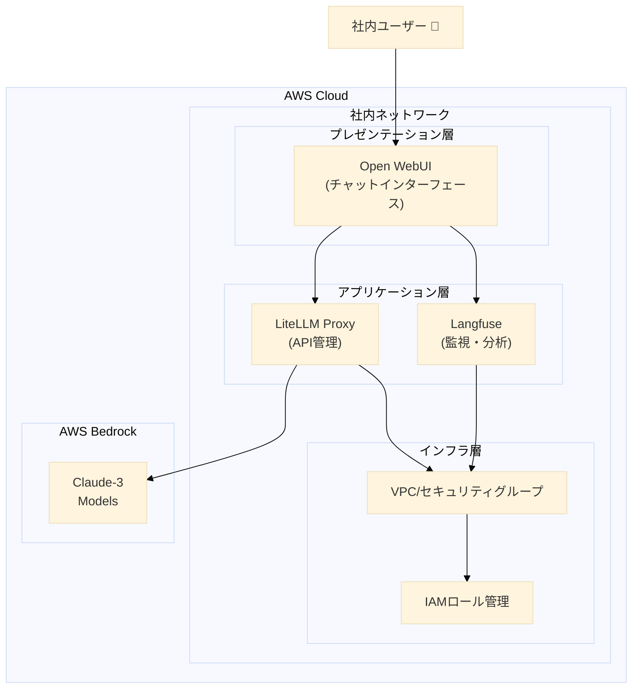

<p align="center">

<h1 align="center">AMATERASU v0.6.1</h1>
</p>

<p align="center">
  <a href="https://github.com/Sunwood-ai-labs/AMATERASU">
    
  </a>
  <a href="https://github.com/Sunwood-ai-labs/AMATERASU/releases">
    
  </a>
  <a href="https://github.com/Sunwood-ai-labs/AMATERASU/blob/main/LICENSE">
    
  </a>
</p>

<h2 align="center">
  エンタープライズグレードのプライベートAIプラットフォーム
</h2>

>[!IMPORTANT]
>このリポジトリは[SourceSage](https://github.com/Sunwood-ai-labs/SourceSage)を活用しており、リリースノートやREADME、コミットメッセージの9割は[SourceSage](https://github.com/Sunwood-ai-labs/SourceSage) ＋ [claude.ai](https://claude.ai/)で生成しています。

>[!NOTE]
>AMATERASUは[MOA](https://github.com/Sunwood-ai-labs/MOA)の後継プロジェクトです。各AIサービスを独立したEC2インスタンス上でDocker Composeを用いて実行し、Terraformで簡単にデプロイできるように進化させました。

https://github.com/user-attachments/assets/90f382c2-6b4a-42c4-9543-887ecc67b6eb

## 🔒 セキュリティ重視の設計思想

AMATERASUは、セキュリティ要件の厳しい日本企業向けに特化して開発された、プライベートなAIプラットフォーム基盤です。AWS Bedrockを基盤とした安全なLLM活用を実現します：

- **AWS Bedrock による安全なLLM基盤**:
  - 企業向けに最適化された Claude-3 モデルをサポート
  - AWSのエンタープライズグレードのセキュリティ
  - IAMロールベースのきめ細やかなアクセス制御

- **完全クローズド環境での運用**: 
  - 社内ネットワーク内でのみ動作
  - プライベートクラウド/オンプレミス対応

- **エンタープライズグレードのセキュリティ**: 
  - IPホワイトリストによるアクセス制御
  - HTTPS/TLS暗号化通信
  - AWS Security Groupによるネットワークセグメンテーション
  - 最小権限原則に基づいたIAMロール管理

## ✨ 主要機能

### 1. セキュアなChatGPTライクインターフェース (Open WebUI)
- 社内向けチャットUIの提供
- プロンプトテンプレート管理
- 会話履歴の保存と検索

### 2. セキュアなAPIプロキシサーバー (LiteLLM)
- AWS Bedrockを基盤としたセキュアなLLMアクセス
- Claude-3シリーズ（Opus/Sonnet/Haiku）の統合管理
- リクエストの負荷分散とレート制限
- APIキーの一元管理

### 3. コスト管理・監視基盤 (Langfuse)
- トークン使用量の可視化
- 部門別コスト集計
- 利用状況分析

## 🏗️ システムアーキテクチャ

### AWS Bedrockベースのセキュア3層アーキテクチャ




## 📊 リソース要件

最小構成：
- EC2: t3.medium (2vCPU/4GB)
- Storage: 50GB gp2
- Network: パブリックサブネット

推奨構成：
- EC2: t3.large (2vCPU/8GB)
- Storage: 100GB gp2
- Network: パブリック/プライベートサブネット


## 💼 企業での活用シーン

1. **開発部門**
   - コードレビュー支援
   - バグ解析の効率化
   - ドキュメント生成

2. **業務部門**
   - レポート作成支援
   - データ分析補助
   - 議事録作成

3. **カスタマーサポート**
   - 問い合わせ対応の効率化
   - FAQ自動生成
   - 返信文面の品質向上

## 🔧 導入・運用

### セットアップ手順
```bash
# 1. リポジトリのクローン
git clone https://github.com/Sunwood-ai-labs/AMATERASU.git
cd AMATERASU

# 2. 環境変数の設定
cp .env.example .env
# .envファイルを編集して認証情報を設定

# 3. インフラのデプロイ
cd spellbook/base-infrastructure
terraform init && terraform apply

cd ../open-webui/terraform/main-infrastructure
terraform init && terraform apply

# 4. サービスの起動
# Langfuse (監視基盤)
cd ../../langfuse
docker-compose up -d

# LiteLLM (APIプロキシ)
cd ../litellm
docker-compose up -d

# Open WebUI (ユーザーインターフェース)
cd ../open-webui
docker-compose up -d
```

## 📚 詳細ドキュメント

- [Spellbook インフラ構築ガイド](spellbook/README.md)
- [LiteLLM 設定ガイド](spellbook/litellm/README.md)
- [Langfuse セットアップガイド](spellbook/langfuse/README.md)

## 🆕 最新情報

### v0.6.1 の更新内容

- ドキュメントの更新とREADMEファイルへの重要な情報の追加。
- 英語READMEと日本語READMEの更新。
- SourceSageとclaude.aiを用いた開発プロセスに関する情報の追加。
- セキュリティ関連の記述の簡素化。


### v0.6.0 の更新内容

- CloudFrontインフラの削除に伴い、不要になったリソースを削除しました。
- コードを簡素化し、保守性を向上させました。
- アプリケーションのHTTPSとHTTP URLを出力に追加しました。
- 環境変数ファイルとセットアップスクリプトのパスを`terraform.tfvars`で容易に変更できるようにしました。
- 不要な変数定義を削除しました。
- セットアップスクリプトを簡素化しました。


## 💰 コスト管理

Langfuseによる詳細なコスト分析と管理機能を提供：
- モデルごとの利用コスト追跡
- 予算アラートの設定
- 使用量の可視化

## 👏 謝辞

iris-s-coonとMakiへの貢献に感謝します。

## 📄 ライセンス

このプロジェクトはMITライセンスの下で公開されています。詳細は[LICENSE](LICENSE)ファイルをご覧ください。

## 🤝 コントリビューション

1. このリポジトリをフォーク
2. 新しいブランチを作成 (`git checkout -b feature/amazing-feature`)
3. 変更をコミット (`git commit -m 'Add amazing feature'`)
4. ブランチをプッシュ (`git push origin feature/amazing-feature`)
5. プルリクエストを作成

## 📧 サポート

ご質問やフィードバックがありましたら、以下までお気軽にご連絡ください：
- Issue作成: [GitHub Issues](https://github.com/Sunwood-ai-labs/AMATERASU/issues)
- メール: support@sunwoodai.com

---

AMATERASUで、セキュアで効率的なAIインフラを構築しましょう。✨
