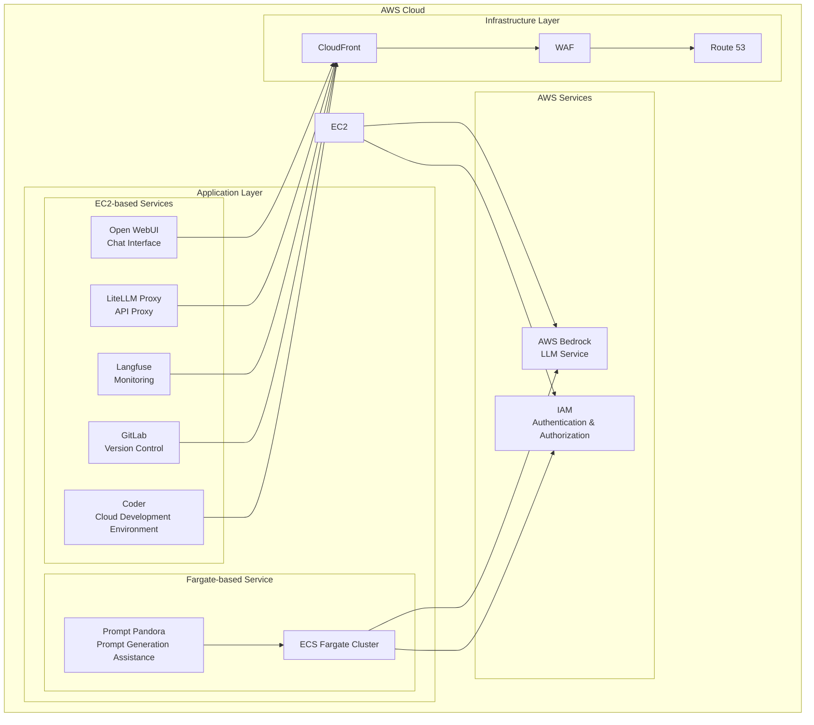

<p align="center">
  
</p>

<p align="center">
  <a href="https://github.com/Sunwood-ai-labs/AMATERASU"></a>
  <a href="https://github.com/Sunwood-ai-labs/AMATERASU/releases"></a>
  <a href="https://github.com/Sunwood-ai-labs/AMATERASU/blob/main/LICENSE"></a>
</p>

<h2 align="center">Enterprise-Grade Private AI Platform (v1.16.0)</h2>

>[!IMPORTANT]
>This repository leverages [SourceSage](https://github.com/Sunwood-ai-labs/SourceSage), and approximately 90% of the release notes, README, and commit messages were generated using [SourceSage](https://github.com/Sunwood-ai-labs/SourceSage) + [claude.ai](https://claude.ai/).

>[!NOTE]
>AMATERASU is the successor project to [MOA](https://github.com/Sunwood-ai-labs/MOA).  It has evolved to run each AI service as an independent EC2 instance using Docker Compose, enabling easy deployment with Terraform.

## 🚀 Project Overview

AMATERASU is an enterprise-grade private AI platform. Built on AWS Bedrock and Google Vertex AI, it allows you to develop and operate LLM-powered applications in a secure and scalable environment.  Integration with GitLab streamlines version control, CI/CD pipelines, and project management.  v1.16.0 includes a new project discovery feature and removes unnecessary files and modules, resulting in a cleaner, more maintainable codebase.


This repository is structured as a "spellbook" for managing multiple AI-related projects. Each project is organized as a separate folder for deploying and managing specific AI services or functionalities.

## ✨ Key Features

### Secure Foundation
- Secure LLM foundation based on AWS Bedrock and Google Vertex AI
- Operation in a fully closed environment
- Enterprise-grade security

### Microservice Architecture
- Independent service components
- Container-based deployment
- Flexible scaling

### Infrastructure as Code
- Fully automated deployment with Terraform
- Environment-specific configuration management
- Version-controlled infrastructure

### GitLab Integration
- Enhanced version control, CI/CD pipelines, and project management
- Integration with self-hosted GitLab instances
- LLM-powered merge request analysis
- Automated labeling using GitLab Webhooks

### Project Discovery Feature
- Automatic detection of Terraform projects and generation of `terraform.tfvars` files
- Simplified configuration using the `amaterasu` command-line tool

## 🏗️ System Architecture



## 📦 Component Structure

### 1. Open WebUI (Frontend)
- Chat-based user interface
- Responsive design
- Prompt template management
    - [Details here](./spellbook/open-webui/README.md)

### 2. LiteLLM (API Proxy)
- Unified access to Claude-3 series models
- Access to Google Vertex AI models
- API key management and rate limiting
    - [Details here](./spellbook/litellm/README.md)

### 3. Langfuse (Monitoring)
- Usage tracking
- Cost analysis
- Performance monitoring
    - [Details here](./spellbook/langfuse3/README.md)

### 4. GitLab (Version Control)
- Self-hosted GitLab instance
- Project and code management
- CI pipeline and Runner configuration
- Backup and restore functionality

### 5. FG-prompt-pandora (Fargate-based Sample Application)
- Auto-scaling on AWS Fargate
- Prompt generation using Claude-3.5-Sonnet
- Intuitive UI based on Streamlit
    - [Details here](./spellbook/fg-prompt-pandora/README.md)

### 6. Coder (Cloud Development Environment)
- Web-based IDE
- Support for VS Code extensions
- Secure development on AWS infrastructure
    - [Details here](./spellbook/Coder/README.md)

### 7. Dify (AI Application Development Platform)
- AI application development platform integrating various AI models
- UI/API-based development is possible
    - [Details here](./spellbook/dify/README.md)

### 8. Dify Beta (AI Application Development Platform)
- Beta version of Dify including new and experimental features
- Advanced settings for vector databases and sandbox environments are possible
    - [Details here](./spellbook/dify-beta1/README.md)

### 9. Open WebUI Pipeline
- Pipeline functions that enhance the integration with Open WebUI
- It is possible to perform filter processing such as conversation turn restrictions and Langfuse linkage
    - [Details here](./spellbook/open-webui-pipeline/README.md)

### 10. Amaterasu Tool (Terraform Variable Generator)
- Automates the generation of `terraform.tfvars` files using a command-line tool
- Generates settings for each project in the spellbook
- [Details here](./spellbook/amaterasu-tool-ui/README.md)


## 🆕 Latest News

### AMATERASU v1.16.0 (Latest Release)

- 🎉 **Implementation of Project Discovery Feature**:  Use the `amaterasu` command-line tool to explore Terraform projects within the spellbook and automatically generate `terraform.tfvars` files.
- ⚠️ **Removal of Unnecessary Files and Modules**:  Unnecessary files and modules have been removed as part of project restructuring and cleanup.


## 🔧 Usage

Refer to the individual README files for instructions on using each component. For instructions on using the `amaterasu` command-line tool, refer to `spellbook/amaterasu-tool-ui/README.md`.


## 📦 Installation Instructions

1. Clone the repository.
```bash
git clone https://github.com/Sunwood-ai-labs/AMATERASU.git
cd AMATERASU
```
2. Follow the instructions in each project's README to install dependencies and deploy the application.
3. Enter the necessary settings in the `terraform.tfvars` file. You can also use the `amaterasu` tool to generate it automatically.


## 📦 Dependencies

The root directory of this repository contains a `requirements.txt` file defining common dependencies.
```bash
pip install -r requirements.txt
```

```plaintext
aira
sourcesage
```

## 📄 License

This project is licensed under the MIT License.

## 👏 Acknowledgements

Thanks to iris-s-coon and Maki for their contributions.