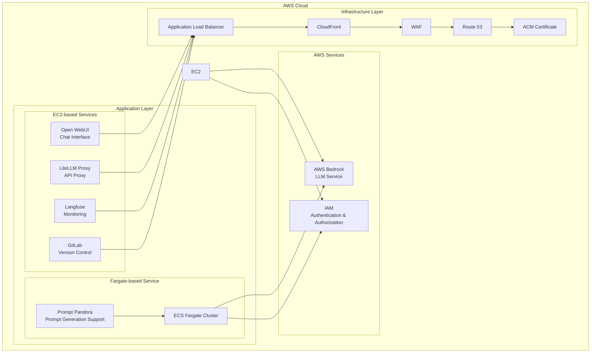

  

  
  
  

<h2 align="center">Enterprise-Grade Private AI Platform (v1.9.0)</h2>

>[!IMPORTANT]
>This repository leverages [SourceSage](https://github.com/Sunwood-ai-labs/SourceSage).  Approximately 90% of the release notes, README, and commit messages were generated using [SourceSage](https://github.com/Sunwood-ai-labs/SourceSage) and [claude.ai](https://claude.ai/).

>[!NOTE]
>AMATERASU is the successor project to [MOA](https://github.com/Sunwood-ai-labs/MOA).  It has been improved to run each AI service as an independent EC2 instance using Docker Compose, allowing for easy deployment with Terraform.

## 🚀 Project Overview

AMATERASU is an enterprise-grade private AI platform. Built on AWS Bedrock and Google Vertex AI, it enables the development and operation of LLM-based applications in a secure and scalable environment. Integration with GitLab streamlines version control, CI/CD pipelines, and project management.

## ✨ Key Features

### Secure Foundation
- Secure LLM foundation based on AWS Bedrock and Google Vertex AI
- Operation in a completely closed environment
- Enterprise-grade security

### Microservice Architecture
- Independent service components
- Container-based deployment
- Flexible scaling

### Infrastructure as Code
- Fully automated deployment with Terraform
- Environment-specific configuration management
- Version-controlled configuration

### GitLab Integration
- Enhanced version control, CI/CD pipelines, and project management features
- Integration with self-hosted GitLab instances
- LLM-powered merge request analysis
- Automated labeling using GitLab Webhooks

## 🏗️ System Architecture

## 📦 Component Composition

### 1. Open WebUI (Frontend)
- Chat-based user interface
- Responsive design
- Prompt template management

### 2. LiteLLM (API Proxy)
- Unified access to Claude-3 series models
- Access to Google Vertex AI models
- API key management and rate limiting

### 3. Langfuse (Monitoring)
- Usage tracking
- Cost analysis
- Performance monitoring

### 4. GitLab (Version Control)
- Self-hosted GitLab instance
- Project and code management
- CI pipeline and Runner configuration
- Backup and restore functionality

### 5. FG-prompt-pandora (Fargate Sample Application)
- Auto-scaling on AWS Fargate
- Prompt generation using Claude-3.5-Sonnet
- Intuitive UI based on Streamlit

## 🆕 Latest News

### AMATERASU v1.9.0 (Latest Release)

- 🎉 **Enhanced Security with CloudFront and WAF**: Security significantly improved with the introduction of CloudFront and WAF v2. Whitelisted IP addresses are managed in `whitelist-waf.exmaple.csv`.
- 🎉 **Improved Security Group Configuration for Base Infrastructure**: Added default settings to the base security group. Added rules to allow access from whitelisted IP addresses. Whitelisted IP addresses are managed in `whitelist-base-sg.example.csv`.
- 🎉 **Added DeepSeek API Key Setting**: Added a DeepSeek API key setting item to the `.env.example` file.
- 🚀 **Updated README.md files**: Added and updated information on infrastructure configuration, security settings, and usage in each project's README.md file. Version numbers updated.
- 🚀 **Updated English README**: Updated the English README.
- 🚀 **Added Explanations to terraform.example.tfvars**: Added explanations of the role and configuration method of each variable to the `terraform.example.tfvars` file.
- 🚀 **Updated terraform.tfvars**: Updated variables in the `terraform.tfvars` file, adding `domain` and `subdomain`.
- 🚀 **Updated LiteLLM README**: Added descriptions regarding security enhancements and simplified configuration.
- 🚀 **Updated Base Infrastructure README**: Updated descriptions regarding security and CloudFront/WAF implementation.
- ⚠️ **Significant Infrastructure Changes**: Removed ALB and CloudFront-related Terraform modules, simplifying the infrastructure configuration.  Back up your existing infrastructure and settings before upgrading.
- ⚠️ **Updated VPC and Subnet IDs**: Updated the VPC and subnet IDs for the LiteLLM project.

## 🛠️ Usage

Refer to the README file for each component for instructions on its usage.

## 📦 Installation Instructions

1. Clone the repository.
2. Follow the instructions in each project's README to install dependencies and deploy the application.
3. Enter the necessary settings in the `terraform.tfvars` file.

## 📄 License

This project is licensed under the MIT License.

## 👏 Acknowledgements

Thanks to iris-s-coon and Maki for their contributions.