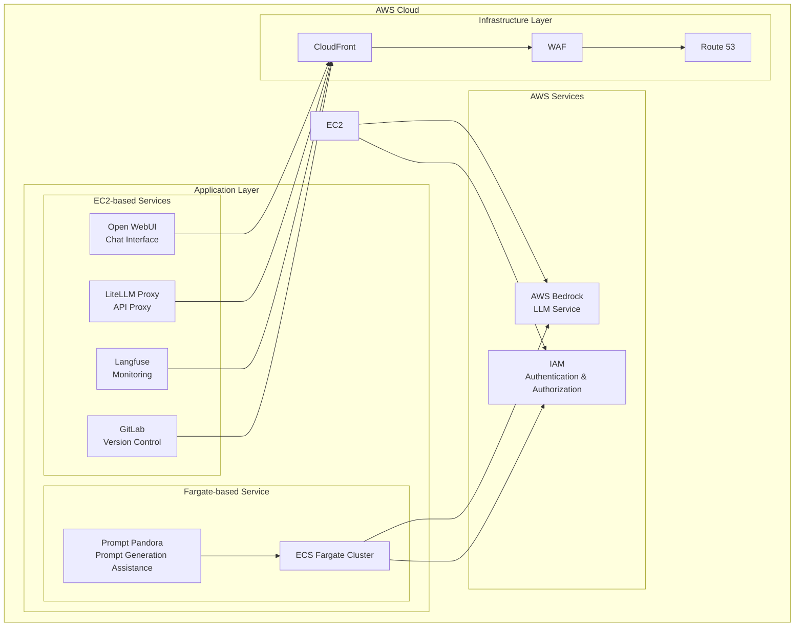

  

  
  
  

<h2 align="center">Enterprise-Grade Private AI Platform (v1.14.0)</h2>

>[!IMPORTANT]
>This repository leverages [SourceSage](https://github.com/Sunwood-ai-labs/SourceSage), and approximately 90% of the release notes, README, and commit messages are generated using [SourceSage](https://github.com/Sunwood-ai-labs/SourceSage) + [claude.ai](https://claude.ai/).

>[!NOTE]
>AMATERASU is the successor project to [MOA](https://github.com/Sunwood-ai-labs/MOA).  It has evolved to run each AI service on an independent EC2 instance using Docker Compose, enabling easy deployment with Terraform.

## 🚀 Project Overview

AMATERASU is an enterprise-grade private AI platform. Built on AWS Bedrock and Google Vertex AI, it allows you to develop and operate LLM-based applications in a secure and scalable environment. Integration with GitLab streamlines version control, CI/CD pipelines, and project management.  v1.14.0 includes Terraform code to simplify the construction and management of AWS infrastructure, and a module to facilitate the creation of CloudFront infrastructure.  Setup scripts and output value definitions have also been added to improve Dify setup and operation.

## ✨ Key Features

### Secure Foundation
- Secure LLM foundation based on AWS Bedrock and Google Vertex AI
- Operation in a completely closed environment
- Enterprise-grade security

### Microservice Architecture
- Independent service components
- Container-based deployment
- Flexible scaling

### Infrastructure as Code
- Fully automated deployment with Terraform
- Environment-specific configuration management
- Version-controlled configuration

### GitLab Integration
- Enhanced version control, CI/CD pipelines, and project management
- Integration with self-hosted GitLab instances
- LLM-powered merge request analysis
- Automated labeling using GitLab Webhooks

## 🏗️ System Architecture

## 📦 Component Composition

### 1. Open WebUI (Frontend)
- Chat-based user interface
- Responsive design
- Prompt template management

### 2. LiteLLM (API Proxy)
- Unified access to Claude-3 series models
- Access to Google Vertex AI models
- API key management and rate limiting

### 3. Langfuse (Monitoring)
- Usage tracking
- Cost analysis
- Performance monitoring

### 4. GitLab (Version Control)
- Self-hosted GitLab instance
- Project and code management
- CI pipeline and Runner configuration
- Backup and restore functionality

### 5. FG-prompt-pandora (Fargate Sample Application)
- Auto-scaling on AWS Fargate
- Prompt generation using Claude-3.5-Sonnet
- Intuitive UI based on Streamlit

## 🆕 Latest News

### AMATERASU v1.14.0 (Latest Release)

- 🎉 **Setup Script Implementation:** Automates cloning the AMATERASU repository, setting environment variables, and starting the application using Docker Compose after launching an EC2 instance.
- 🎉 **Terraform Configuration for CloudFront Infrastructure Module:** Implemented a Terraform module to manage CloudFront distributions, WAFv2, Route53 records, and ACM certificates.
- 🎉 **Added Terraform Code for Main Infrastructure Construction:** Integrated IAM, Compute, and Networking modules into the main Terraform file.
- 🎉 **Defined Output Values for Built Infrastructure:** Defined output values for the built infrastructure resources.
- 🎉 **Added Variables for CloudFront Infrastructure:** Added variables required for configuring the CloudFront infrastructure.
- 🎉 **Created and Configured Common Variable File:** Defined commonly used variables in `common_variables.tf` to improve modularity and reusability of resource definitions across all infrastructure resources.

## 🛠️ How to Use

Refer to the README file for each component for usage instructions.  Specifically, refer to `spellbook/tfvars_generator/README.md` for instructions on using the Terraform variable generator web application.

## 📦 Installation Instructions

1. Clone the repository.
2. Follow the instructions in each project's README to install dependencies and deploy the application.
3. Enter the necessary settings in the `terraform.tfvars` file.

## 📄 License

This project is licensed under the MIT License.

## 👏 Acknowledgements

Thanks to Maki and iris-s-coon for their contributions.