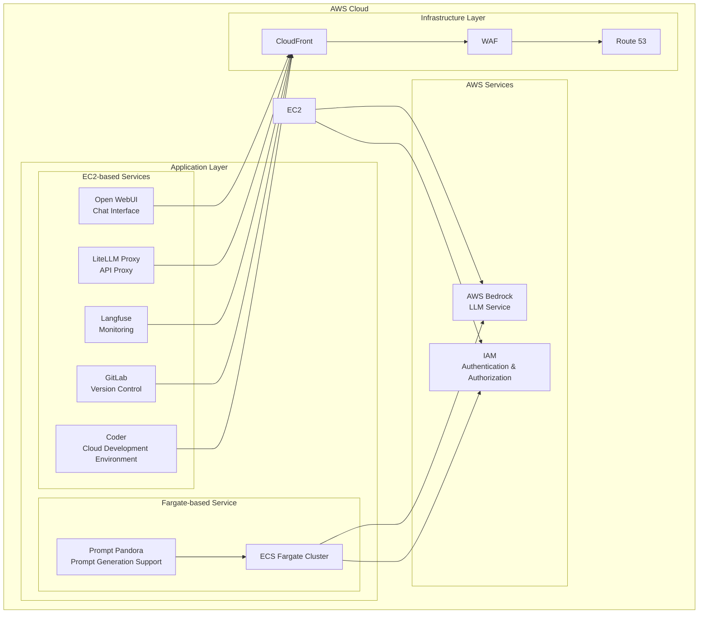

# AMATERASU: Enterprise-Grade Private AI Platform (v1.19.0)

<p align="center">
  
</p>

<p align="center">
  <a href="https://github.com/Sunwood-ai-labs/AMATERASU"></a>
  <a href="https://github.com/Sunwood-ai-labs/AMATERASU/releases"></a>
  <a href="https://github.com/Sunwood-ai-labs/AMATERASU/blob/main/LICENSE"></a>
</p>

<h2 align="center">Enterprise-Grade Private AI Platform (v1.19.0)</h2>

[!IMPORTANT]
This repository leverages [SourceSage](https://github.com/Sunwood-ai-labs/SourceSage).  Approximately 90% of the release notes, README, and commit messages were generated using [SourceSage](https://github.com/Sunwood-ai-labs/SourceSage) and [claude.ai](https://claude.ai/).

[!NOTE]
AMATERASU is the successor project to [MOA](https://github.com/Sunwood-ai-labs/MOA).  It has evolved to run each AI service in a separate EC2 instance using Docker Compose, enabling easy deployment with Terraform.


## 🚀 Project Overview

AMATERASU is an enterprise-grade private AI platform. Built on AWS Bedrock and Google Vertex AI, it allows for the development and operation of LLM-based applications in a secure and scalable environment. Integration with GitLab streamlines version control, CI/CD pipelines, and project management.  Version 1.19.0 significantly improves the flexibility and maintainability of infrastructure configuration management using Terraform.  Specifically, this includes the addition of Terraform variables, output variables, modularization, and the creation of import scripts for existing resources.  Furthermore, this update prioritizes security and operational improvements with additions such as WAF configuration, ECS configuration, and scheduling functionality.  Other improvements include Docker image optimization, UI enhancements, and strengthened error handling.


This repository is structured as a "Spellbook" for managing multiple AI-related projects. Each project is organized as a separate folder for deploying and managing specific AI services or features.

## ✨ Key Features

### Secure Foundation
- Secure LLM foundation based on AWS Bedrock and Google Vertex AI
- Operation in a completely closed environment
- Enterprise-grade security

### Microservice Architecture
- Independent service components
- Container-based deployment
- Flexible scaling

### Infrastructure as Code
- Fully automated deployment with Terraform
- Environment-specific configuration management
- Version-controlled configuration

### GitLab Integration
- Improved version control, CI/CD pipelines, and project management features
- Integration with self-hosted GitLab instances
- LLM-powered merge request analysis
- Automated labeling using GitLab Webhooks

### Project Exploration Feature
- Automatic detection of Terraform projects and generation of `terraform.tfvars` files
- Simplified configuration using the `amaterasu` command-line tool


## 🏗️ System Architecture



## 📦 Component Composition

### 1. Open WebUI (Frontend)
- Chat-based user interface
- Responsive design
- Prompt template management
    - [Details here](./spellbook/open-webui/README.md)

### 2. LiteLLM (API Proxy)
- Unified access to Claude-3 series models
- Access to Google Vertex AI models
- API key management and rate limiting
    - [Details here](./spellbook/litellm/README.md)

### 3. Langfuse (Monitoring)
- Usage tracking
- Cost analysis
- Performance monitoring
    - [Details here](./spellbook/langfuse3/README.md)

### 4. GitLab (Version Control)
- Self-hosted GitLab instance
- Project and code management
- CI pipeline and Runner configuration
- Backup and restore functionality

### 5. FG-prompt-pandora (Fargate-based Sample Application)
- Auto-scaling on AWS Fargate
- Prompt generation using Claude-3.5-Sonnet
- Intuitive UI based on Streamlit
    - [Details here](./spellbook/fg-prompt-pandora/README.md)

### 6. Coder (Cloud Development Environment)
- Web-based IDE environment
- Support for VS Code extensions
- Secure development on AWS infrastructure
    - [Details here](./spellbook/Coder/README.md)

### 7. Dify (AI Application Development Platform)
- AI application development platform integrating various AI models
- UI/API-based development possible
    - [Details here](./spellbook/dify/README.md)

### 8. Dify Beta (AI Application Development Platform)
- Beta version of Dify including new and experimental features
- Advanced configuration of vector databases and sandbox environments
    - [Details here](./spellbook/dify-beta1/README.md)

### 9. Open WebUI Pipeline
- Pipeline features enhancing integration with Open WebUI
- Filter processing such as conversation turn limits and Langfuse integration
    - [Details here](./spellbook/open-webui-pipeline/README.md)

### 10. Amaterasu Tool (Terraform Variable Generator)
- Automates the generation of `terraform.tfvars` files using a command-line tool
- Generates settings for each project in the spellbook
    - [Details here](./spellbook/amaterasu-tool-ui/README.md)


## 🆕 Latest Information

### AMATERASU v1.19.0 (Latest Release)

- 🎉 **Addition of Terraform Variables**: AWS region, project name, VPC settings, EC2 instance settings, application settings, and WAF settings can now be flexibly configured.
- 🎉 **Addition of Terraform Outputs**: Information about CloudFront, ECS, and security groups can now be retrieved.
- 🎉 **Addition of WAF (Web Application Firewall) Configuration**: A WAF Web ACL is created to protect CloudFront, and access restrictions are set using an IP whitelist.
- 🎉 **Addition of Security Group Configuration**: A security group is created to allow communication between ECS tasks and ALB.
- 🎉 **Addition of Application Scheduling Configuration**: Using Auto Scaling Target, the DesiredCount of the ECS service is adjusted to start at 8:00 AM (JST) on weekdays and stop at 10:00 PM (JST) on weekdays.
- 🎉 **Addition of IAM (Identity and Access Management) Configuration**: ECS instance profiles, ECS task roles, and ECS execution roles are created and the necessary policies are attached.
- 🎉 **Addition of ECS (Elastic Container Service) Configuration**: An ECS cluster, task definition, and service are created and configured to integrate with CloudWatch Logs and ALB.
- 🎉 **Addition of EC2 Instance and AutoScaling Configuration**: Configuration to launch EC2 instances to run ECS tasks is added, and the instance count is managed using an Auto Scaling Group.
- 🎉 **Addition of CloudFront Configuration**: A CloudFront Distribution configuration with ALB as the origin is added.
- 🎉 **Addition of ALB (Application Load Balancer) Configuration**: ALB, listeners, target groups, and security groups are created, and the ALB is configured to forward HTTP traffic to the ECS service.
- 🎉 **Addition of Animated Header Image**: An animated SVG image is added as the application header.
- 🎉 **UI Improvements and Enhanced Error Handling**: A user-friendly interface is created using Streamlit, and error handling is strengthened.
- 🎉 **Creation of Import Script for Existing AWS Resources into Terraform State**: A script to import existing AWS resources into the Terraform state is created.
- 🎉 **Creation of Deployment Script to AWS ECS**: A script to deploy Docker images to the AWS ECS cluster and service is created.
- 🎉 **Docker Image Optimization and Addition of Health Checks**: The image size is reduced by basing it on the Python 3.11-slim image, and a health check command is added.
- 🚀 **Modularization and Variabilization of Terraform Configuration**: The overall configuration is modularized, and variables for each module are defined.
- 🚀 **Update of README File**: The application overview, features, environment setup methods, usage, debugging information, and deployment procedures to AWS ECS Fargate are described in detail.
- 🚀 **Correction of docker-compose.yml and Health Check Settings**: The docker-compose.yml settings are corrected, and port mapping and health checks are correctly configured.
- 🚀 **Improvement of Coder Image Python, Node.js Installation and Code Server Settings**: Python3 and pip, Node.js and npm are installed, and Python3 is set as the default Python.
- 🚀 **Dependency Updates and Additions**: The Streamlit, OpenAI, and requests libraries are updated to the latest versions, and the dnspython library is added.
- 🐛 **Port Correction in docker-compose.yml**: The ClickHouse port 9000 is commented out.
- ⚠️ **Removal of ALB-related Resources**: Migrated from a load balancing configuration using a global accelerator and ALB to a configuration using CloudFront.


## 🔧 Usage

Refer to the README file for each component for usage instructions.  For instructions on using the `amaterasu` command-line tool, see `spellbook/amaterasu-tool-ui/README.md`.


## 📦 Installation Instructions

1. Clone the repository.
```bash
git clone https://github.com/Sunwood-ai-labs/AMATERASU.git
cd AMATERASU
```
2. Follow the instructions in each project's README to install dependencies and deploy the application.
3. Enter the necessary settings in the `terraform.tfvars` file.  You can also use the `amaterasu` tool to automatically generate it.


## 📦 Dependencies

The root directory of this repository contains a `requirements.txt` file defining common dependencies.
```bash
pip install -r requirements.txt
```

```plaintext
aira
sourcesage
```

## 📄 License

This project is licensed under the MIT License.

## 👏 Acknowledgments

Thanks to iris-s-coon and Maki for their contributions.