# 🚀 AMATERASU v1.1.0

<p align="center">
  
</p>

<p align="center">
  <a href="https://github.com/Sunwood-ai-labs/AMATERASU"></a>
  <a href="https://github.com/Sunwood-ai-labs/AMATERASU/releases"></a>
  <a href="https://github.com/Sunwood-ai-labs/AMATERASU/blob/main/LICENSE"></a>
</p>

<h2 align="center">Enterprise-Grade Private AI Platform</h2>

>[!IMPORTANT]
>This repository leverages [SourceSage](https://github.com/Sunwood-ai-labs/SourceSage). Approximately 90% of the release notes, README, and commit messages are generated using [SourceSage](https://github.com/Sunwood-ai-labs/SourceSage) and [claude.ai](https://claude.ai/).

>[!NOTE]
>AMATERASU is the successor project to [MOA](https://github.com/Sunwood-ai-labs/MOA).  It has been improved to run each AI service as an independent EC2 instance using Docker Compose, and deployment is simplified using Terraform.


## 🌟 Key Features

### Secure Foundation
- Secure LLM foundation based on AWS Bedrock
- Operation in a completely closed environment
- Enterprise-grade security

### Microservice Architecture
- Independent service components
- Container-based deployment
- Flexible scaling

### Infrastructure as Code
- Fully automated deployment with Terraform
- Environment-specific configuration management
- Version-controlled infrastructure

## 🏗 System Architecture



## 📦 Component Composition

### 1. Open WebUI (Frontend)
- Chat-based user interface
- Responsive design
- Prompt template management

### 2. LiteLLM (API Proxy)
- Unified access to Claude-3 series models
- API key management
- Rate limiting and load balancing

### 3. Langfuse (Monitoring)
- Usage tracking
- Cost analysis
- Performance monitoring

### 4. FG-prompt-pandora (Fargate Sample Application)
- Auto-scaling on AWS Fargate
- Prompt generation using Claude-3.5-Sonnet
- Intuitive UI based on Streamlit
- Easy deployment with a simple Docker image
- Integration sample for the AMATERASU environment

## 🛠 Deployment Guide

### Prerequisites
- AWS Account
- Terraform >= 0.12
- Docker & Docker Compose
- AWS CLI configured

### Setup Instructions

1. Clone the repository
```bash
git clone https://github.com/Sunwood-ai-labs/AMATERASU.git
cd AMATERASU
```

2. Set environment variables
```bash
cp .env.example .env
# Edit .env with your configuration
```

3. Deploy the infrastructure
```bash
cd spellbook/base-infrastructure
terraform init && terraform apply

cd ../open-webui/terraform/main-infrastructure
terraform init && terraform apply

cd ../../litellm/terraform/main-infrastructure
terraform init && terraform apply

cd ../../langfuse/terraform/main-infrastructure
terraform init && terraform apply
```

4. Start the services
```bash
# Langfuse
cd ../../../langfuse
docker-compose up -d

# LiteLLM
cd ../litellm
docker-compose up -d

# Open WebUI
cd ../open-webui
docker-compose up -d

# FG-prompt-pandora
cd ../FG-prompt-pandora
docker-compose up -d
```

## 📈 Operation and Management

### Monitoring
- Metrics collection with Prometheus
- Usage analysis with Langfuse
- Resource monitoring with CloudWatch

### Scheduling
- Automatic start/stop from 8:00 AM to 10:00 PM on weekdays
- Manual scaling according to demand
- Batch job scheduling

### Security
- IP whitelist control
- TLS/SSL encryption
- IAM role-based access control

## 💡 Use Cases

### Prompt Engineering Support
- Optimal prompt generation from task descriptions
- Suggestions for improving existing prompts
- Management and sharing of prompt templates
- Standardization of prompt quality across the team

### LLM Application Development
- Secure model access via API proxy
- Visualization and analysis of usage
- Cost management and resource optimization
- Provision of a secure development environment

## 🆕 Latest Updates (v1.1.0)

- 🎉 **Added FG-prompt-pandora module**: A prompt generation support tool running on AWS Fargate. It uses the Claude-3.5-Sonnet model and a Streamlit UI, and is easily deployable with Docker Compose and Terraform. Supports auto-scaling with AWS Fargate.
- 🚀 Completely revised README.md to improve readability. This includes revised headings, added bullet points, simplified expressions, rewriting the system architecture diagram using mermaid notation, detailed explanations of each function and specific usage scenarios, and strengthened security descriptions.
- 🚀 Updated the English README with the latest information.
- 🚀 Updated version numbers of release notes and related files to v1.1.0.
- 🚀 Updated the document generation model from `gemini/gemini-1.5-flash` to `gemini/gemini-exp-1121`.
- 🚀 Added the `restart: always` option to the Docker Compose file. This enables automatic service restart.


## 📝 License

This project is licensed under the MIT License. See the [LICENSE](LICENSE) file for details.

## 🤝 Contribution

1. Fork this repository
2. Create a feature branch (`git checkout -b feature/amazing-feature`)
3. Commit your changes (`git commit -m 'Add amazing feature'`)
4. Push the branch (`git push origin feature/amazing-feature`)
5. Create a pull request

## 📞 Support

For questions or feedback, please feel free to contact us:
- GitHub Issues: [Issues](https://github.com/Sunwood-ai-labs/AMATERASU/issues)
- Email: support@sunwoodai.com

## 👥 Acknowledgements

We thank iris-s-coon and Maki for their contributions.

---

Build your enterprise-grade AI platform with AMATERASU. ✨