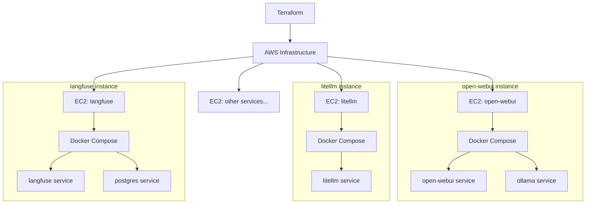

<p align="center">

<h1 align="center">🌄 AMATERASU 🌄</h1>
</p>

<p align="center">
  <a href="https://github.com/Sunwood-ai-labs/AMATERASU">
    
  </a>
  <a href="https://github.com/Sunwood-ai-labs/AMATERASU/releases">
    
  </a>
  <a href="https://github.com/Sunwood-ai-labs/AMATERASU/blob/main/LICENSE">
    
  </a>
  <a href="https://github.com/Sunwood-ai-labs/AMATERASU/stargazers">
    
  </a>
</p>

<h2 align="center">
  ～ Automated Construction of an LLM Platform on AWS ～
</h2>

>[!IMPORTANT]
>AMATERASU is the successor project to [MOA](https://github.com/Sunwood-ai-labs/MOA).  It has evolved to run each AI service on a separate EC2 instance using Docker Compose, allowing for easy deployment with Terraform.

## 🌟 Introduction

AMATERASU is an automation tool for building an LLM (Large Language Model) platform on AWS.  While inheriting the functionality of MOA, it provides more flexible scaling and management by operating each service on a separate EC2 instance.

Key Features:
- Simple EC2 instance management using Terraform
- Separate EC2 instance and Docker Compose environment for each service
- Scalable and manageable at the service level
- Secure communication and access control

## 🚀 Architecture



## 🛠️ System Requirements

- AWS Account
- Environment with Terraform installed
- Docker and Docker Compose (automatically installed on EC2 instances)
- AWS CLI (configured)

## 📦 Installation Instructions

1. Clone the repository:
```bash
git clone https://github.com/Sunwood-ai-labs/AMATERASU.git
cd AMATERASU
```

2. Set environment variables:
```bash
cp .env.example .env
# Edit the .env file and set the necessary credentials
```

3. Initialize and run Terraform:
```bash
cd terraform
terraform init
terraform plan
terraform apply
```

## 🌐 Module Structure

Each module runs using Docker Compose on a separate EC2 instance:

### open-webui Module (EC2 Instance)
```
📁 open-webui/
├── 📄 docker-compose.yml  # Configuration for open-webui and ollama
├── 📄 .env               # Environment variable settings
└── 📁 config/            # Configuration files
```

Example Configuration (docker-compose.yml):
```yaml
version: '3'
services:
  ollama:
    image: ollama/ollama
    ports:
      - "11434:11434"
    volumes:
      - ./data:/root/.ollama

  open-webui:
    image: open-webui/open-webui
    ports:
      - "3000:3000"
    environment:
      - OLLAMA_URL=http://ollama:11434
```

### litellm Module (EC2 Instance)
```
📁 litellm/
├── 📄 docker-compose.yml  # Configuration for the litellm service
├── 📄 .env               # Environment variables such as API keys
└── 📁 config/            # LLM configuration files
```

### langfuse Module (EC2 Instance)
```
📁 langfuse/
├── 📄 docker-compose.yml  # Configuration for langfuse and the database
├── 📄 .env               # Environment variable settings
└── 📁 data/              # PostgreSQL data
```

## 🔨 Deployment Command Examples

Deploying only specific modules:
```bash
# Deploy only the open-webui module
terraform apply -target=module.ec2_open_webui

# Deploy only the litellm module
terraform apply -target=module.ec2_litellm

# Deploy only the langfuse module
terraform apply -target=module.ec2_langfuse
```

## 💻 Module Management Commands

Connecting to each EC2 instance:
```bash
# SSH connection script
./scripts/connect.sh open-webui
./scripts/connect.sh litellm
./scripts/connect.sh langfuse
```

Docker Compose operations:
```bash
# Execute within each instance
cd /opt/amaterasu/[module-name]
docker-compose up -d      # Start services
docker-compose down      # Stop services
docker-compose logs -f   # Display logs
```

## 🔒 Security Configuration

- Each EC2 instance is protected by a separate security group.
- Inter-service communication is controlled by the internal VPC network.
- Only the minimum necessary ports are exposed.
- Permission management via IAM roles.

## 📚 Directory Structure

```plaintext
amaterasu/
├── terraform/          # Terraform code
│   ├── modules/        # Modules for each EC2 instance
│   ├── main.tf        # Main configuration
│   └── variables.tf   # Variable definitions
├── modules/           # Docker Compose configuration for each service
│   ├── open-webui/    # open-webui related files
│   ├── litellm/      # litellm related files
│   └── langfuse/     # langfuse related files
├── scripts/          # Operational scripts
└── docs/            # Documentation
```

## 🤝 Contributions

Contributions are welcome!  Follow these steps to participate:

1. Fork this repository.
2. Create a new branch (`git checkout -b feature/amazing-feature`).
3. Commit your changes (`git commit -m 'Add amazing feature'`).
4. Push the branch (`git push origin feature/amazing-feature`).
5. Create a pull request.

## 📄 License

This project is licensed under the MIT License.  See the [LICENSE](LICENSE) file for details.

## 🌟 Acknowledgements

AMATERASU is supported by the following projects:

- [MOA](https://github.com/Sunwood-ai-labs/MOA) - The foundational project
- [open-webui](https://github.com/open-webui/open-webui)
- [litellm](https://github.com/BerriAI/litellm)
- [langfuse](https://github.com/langfuse/langfuse)
- [Terraform](https://www.terraform.io/)

## 📧 Support

For questions or feedback, please feel free to contact us:
- Create an issue: [GitHub Issues](https://github.com/Sunwood-ai-labs/AMATERASU/issues)
- Email: support@sunwoodai.com

Build a more flexible and powerful AI infrastructure with AMATERASU! ✨