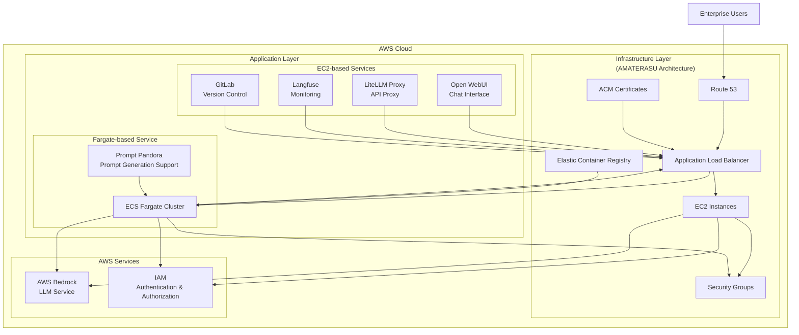

<p align="center">
  
</p>

<p align="center">
  <a href="https://github.com/Sunwood-ai-labs/AMATERASU"></a>
  <a href="https://github.com/Sunwood-ai-labs/AMATERASU/releases"></a>
  <a href="https://github.com/Sunwood-ai-labs/AMATERASU/blob/main/LICENSE"></a>
</p>

<h2 align="center">Enterprise-Grade Private AI Platform (v1.6.0)</h2>

>[!IMPORTANT]
>This repository leverages [SourceSage](https://github.com/Sunwood-ai-labs/SourceSage), and approximately 90% of the release notes, README, and commit messages are generated using [SourceSage](https://github.com/Sunwood-ai-labs/SourceSage) + [claude.ai](https://claude.ai/).

>[!NOTE]
>AMATERASU is the successor project to [MOA](https://github.com/Sunwood-ai-labs/MOA).  It has evolved to run each AI service on an independent EC2 instance using Docker Compose, enabling easy deployment with Terraform.

## 🚀 Project Overview

AMATERASU is an enterprise-grade private AI platform. Built on AWS Bedrock, it allows you to develop and operate LLM-powered applications in a secure and scalable environment.  Integration with GitLab streamlines version control, CI/CD pipelines, and project management. AMATERASU v1.6.0 enhances GitLab environment setup and LLM reviewer functionality.


## ✨ Key Features

### Secure Foundation
- Secure LLM foundation based on AWS Bedrock
- Operation in a completely closed environment
- Enterprise-grade security

### Microservice Architecture
- Independent service components
- Container-based deployment
- Flexible scaling

### Infrastructure as Code
- Fully automated deployment with Terraform
- Environment-specific configuration management
- Version-controlled configuration

### GitLab Integration
- Improved version control, CI/CD pipelines, and project management features
- Integration with self-hosted GitLab instances
- LLM-powered merge request analysis functionality
- Automated labeling service using GitLab Webhooks


## 🏗️ System Architecture



## 📦 Component Composition

### 1. Open WebUI (Frontend)
- Chat-based user interface
- Responsive design
- Prompt template management

### 2. LiteLLM (API Proxy)
- Unified access to Claude-3 series models
- API key management
- Rate limiting and load balancing

### 3. Langfuse (Monitoring)
- Usage tracking
- Cost analysis
- Performance monitoring

### 4. GitLab (Version Control)
- Self-hosted GitLab instance
- Project and code management
- CI pipeline and GitLab Runner
- Backup and restore functionality
- LDAP/Active Directory integration
- Customizable authentication and access control

### 5. FG-prompt-pandora (Fargate Sample Application)
- Auto-scaling on AWS Fargate
- Prompt generation using Claude-3.5-Sonnet
- Intuitive UI based on Streamlit
- Easy deployment with a simple Docker image
- Sample integration with the AMATERASU environment


## 🔧 Deployment Guide

### Prerequisites
- AWS account
- Terraform >= 0.12
- Docker & Docker Compose
- AWS CLI configured

### Setup Instructions

1. Clone the repository
```bash
git clone https://github.com/Sunwood-ai-labs/AMATERASU.git
cd AMATERASU
```

2. Set environment variables
```bash
cp .env.example .env
# Edit .env with your configuration
```

3. Deploy infrastructure (You need to deploy the infrastructure for each service in the `spellbook` directory individually.)
```bash
cd spellbook/base-infrastructure
terraform init && terraform apply

cd ../open-webui/terraform/main-infrastructure
terraform init && terraform apply

cd ../../litellm/terraform/main-infrastructure
terraform init && terraform apply

cd ../../langfuse/terraform/main-infrastructure
terraform init && terraform apply

cd ../../gitlab/terraform/main-infrastructure
terraform init && terraform apply

cd ../../FG-prompt-pandora/terraform
terraform init && terraform apply
```

4. Start services (You need to start each service in the `spellbook` directory individually.)

```bash
# Langfuse
cd ../../../langfuse
docker-compose up -d

# LiteLLM
cd ../litellm
docker-compose up -d

# Open WebUI
cd ../open-webui
docker-compose up -d

# GitLab
cd ../gitlab
docker-compose up -d

# FG-prompt-pandora
cd ../FG-prompt-pandora
docker-compose up -d
```

### GitLab Setup

1. Create environment configuration file:
```bash
cd spellbook/gitlab
cp .env.example .env
```

2. Set environment variables: Edit the `.env` file and set the necessary environment variables such as `GITLAB_HOME`, `GITLAB_HOSTNAME`, `GITLAB_ROOT_PASSWORD`.

3. Start GitLab:
```bash
docker-compose up -d
```

4. Configure backup (optional): Create a backup directory and run the `docker-compose exec gitlab gitlab-backup create` command to perform a backup.


## 📈 Operation and Management

### Monitoring
- Metrics collection with Prometheus
- Usage analysis with Langfuse
- Resource monitoring with CloudWatch

### Scheduling
- Automatic start/stop from 8:00 AM to 10:00 PM on weekdays
- Manual scaling according to demand
- Batch job scheduling

### Security
- IP whitelist control
- TLS/SSL encryption
- IAM role-based access control

## 💡 Use Cases

### Prompt Engineering Support
- Optimal prompt generation from task descriptions
- Suggestions for improving existing prompts
- Management and sharing of prompt templates
- Standardization of prompt quality across the team

### LLM Application Development
- Secure model access via API proxy
- Visualization and analysis of usage
- Cost management and resource optimization
- Provision of a secure development environment


## 🆕 What's New

### AMATERASU v1.6.0 (Latest Release)

- 🎉 **Implementation of LLM-powered merge request analysis functionality**: Includes OpenAI API integration, prompt engineering for generating review results, saving analysis results to JSON files, defining data structures using data classes, error handling and logging, and configuration via environment variables.
    - Outputs reviews and improvement suggestions from the perspectives of code quality, security, testing, and architecture.
- 🎉 **Implementation of automated labeling service using GitLab Webhooks**: Includes a FastAPI-based webhook server, integration with the GitLab API and OpenAI API (via LiteLLM Proxy), automatic label assignment from Issue titles and descriptions using LLM, ngrok configuration for public URLs in the development environment (development environment only), addition of health check endpoints and logging functionality, authentication via webhook tokens, error handling and exception handling, preservation of existing labels and addition of new labels, enhanced logging functionality, environment variable-based configuration management, type hints and docstrings for improved code quality.
    - Automatically assigns appropriate labels using LLM triggered by Issue events.
- 🚀 **Creation of README.md for GitLab service**: Describes directory structure and Webhook configuration.
- 🚀 **Creation of README.md for GitLab Runner**: Describes configuration, Runner registration methods, and precautions.
- 🚀 **Creation of README.md for the `services` directory**: Describes service configuration and configuration management.
- 🚀 **Design change of `services_header.svg`**: Added animation, changed gradient colors, and added shadows.
- 🚀 **Design change of `agents_header.svg`**: Added animation, changed gradient colors, and added shadows.
- 🚀 **Creation of GitLab configuration directory**: Created a configuration directory.
- 🚀 **Creation of GitLab data directory**: Created a data directory.
- 🚀 **Creation of GitLab log directory**: Created a log directory.
- 🚀 **Creation of GitLab backup directory**: Created a backup directory.
- 🚀 **Creation of GitLab Runner configuration directory**: Created a configuration directory.
- 🚀 **Update of dependent libraries**: Updated versions of FastAPI, uvicorn, python-gitlab, openai, python-dotenv, pydantic, pyngrok, loguru, rich, and argparse.


## 📄 License

This project is licensed under the MIT License. See the [LICENSE](LICENSE) file for details.

## 🤝 Contributions

1. Fork this repository
2. Create a feature branch (`git checkout -b feature/amazing-feature`)
3. Commit your changes (`git commit -m 'Add amazing feature'`)
4. Push the branch (`git push origin feature/amazing-feature`)
5. Create a pull request

## 📞 Support

For questions or feedback, please feel free to contact us:
- GitHub Issues: [Issues](https://github.com/Sunwood-ai-labs/AMATERASU/issues)
- Email: support@sunwoodai.com

## 👏 Acknowledgements

Thanks to Maki and iris-s-coon for their contributions.

---

Build your enterprise-grade AI platform with AMATERASU. ✨