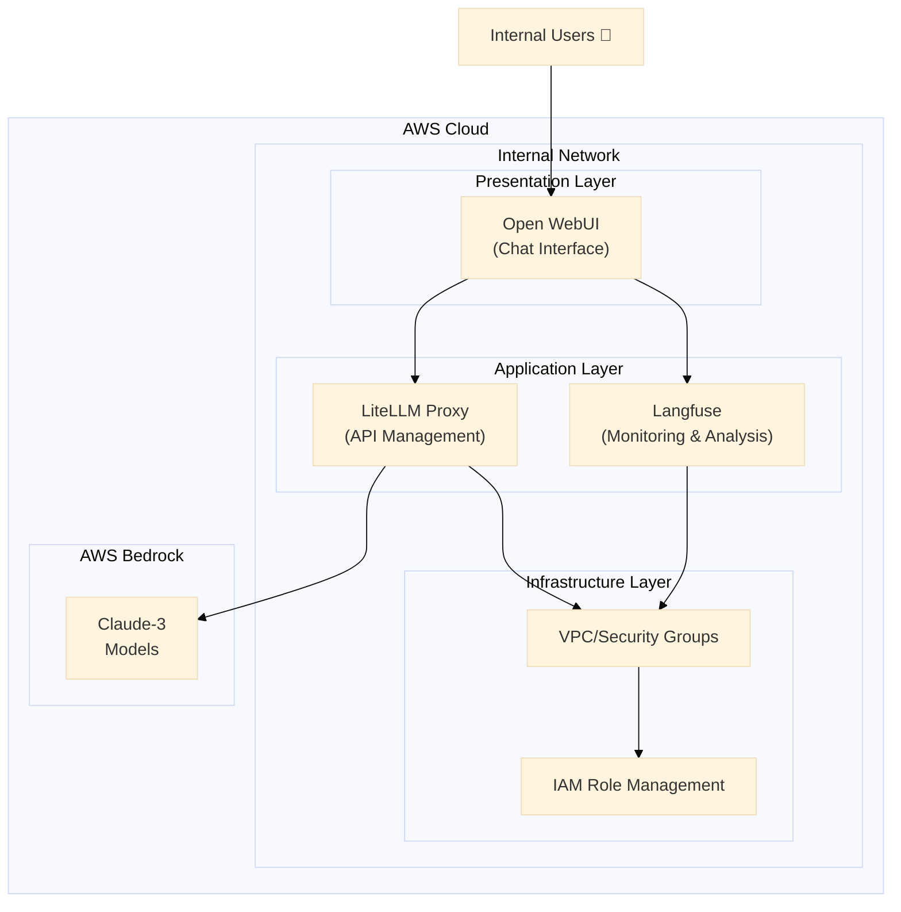

<p align="center">

<h1 align="center">AMATERASU v1.0.0</h1>
</p>

<p align="center">
  <a href="https://github.com/Sunwood-ai-labs/AMATERASU">
    
  </a>
  <a href="https://github.com/Sunwood-ai-labs/AMATERASU/releases">
    
  </a>
  <a href="https://github.com/Sunwood-ai-labs/AMATERASU/blob/main/LICENSE">
    
  </a>
</p>

<h2 align="center">
  Enterprise-Grade Private AI Platform
</h2>

>[!IMPORTANT]
>This repository utilizes [SourceSage](https://github.com/Sunwood-ai-labs/SourceSage). Approximately 90% of the release notes, README, and commit messages were generated using [SourceSage](https://github.com/Sunwood-ai-labs/SourceSage) and [claude.ai](https://claude.ai/).

>[!NOTE]
>AMATERASU is the successor project to [MOA](https://github.com/Sunwood-ai-labs/MOA).  It has evolved to run each AI service in an independent EC2 instance using Docker Compose, making deployment with Terraform significantly easier.


https://github.com/user-attachments/assets/90f382c2-6b4a-42c4-9543-887ecc67b6eb

## 🔒 Security-Focused Design

AMATERASU is a private AI platform infrastructure specifically developed for Japanese enterprises with stringent security requirements. It enables the secure use of LLMs based on AWS Bedrock:

- **Secure LLM Infrastructure with AWS Bedrock**:
  - Supports the Claude-3 model, optimized for enterprise use.
  - Leverages AWS's enterprise-grade security.
  - Granular access control based on IAM roles.

- **Operation in a Fully Closed Environment**:
  - Operates only within the internal network.
  - Supports private cloud/on-premises deployments.

- **Enterprise-Grade Security**:
  - IP whitelisting for access control (directly specified in security group settings).
  - HTTPS/TLS encrypted communication.
  - Network segmentation using AWS Security Groups.
  - IAM role management based on the principle of least privilege.


## ✨ Key Features

### 1. Secure ChatGPT-like Interface (Open WebUI)
- Provides an internal chat UI.
- Manages prompt templates.
- Saves and searches conversation history.

### 2. Secure API Proxy Server (LiteLLM)
- Secure LLM access based on AWS Bedrock.
- Integrated management of the Claude-3 series (Opus/Sonnet/Haiku).
- Load balancing and rate limiting of requests.
- Centralized API key management.

### 3. Cost Management and Monitoring Infrastructure (Langfuse)
- Visualizes token usage.
- Aggregates costs by department.
- Analyzes usage patterns.


## 🏗️ System Architecture

### Secure 3-Tier Architecture Based on AWS Bedrock




## 📊 Resource Requirements

Minimum Configuration:
- EC2: t3.medium (2vCPU/4GB)
- Storage: 50GB gp2
- Network: Public subnet

Recommended Configuration:
- EC2: t3.large (2vCPU/8GB)
- Storage: 100GB gp2
- Network: Public/Private subnet


## 💼 Enterprise Use Cases

1. **Development Department**
   - Code review assistance
   - Bug analysis efficiency improvement
   - Document generation

2. **Business Departments**
   - Report generation assistance
   - Data analysis support
   - Meeting minute creation

3. **Customer Support**
   - Improved efficiency in handling inquiries
   - Automatic FAQ generation
   - Improved quality of reply text


## 🔧 Deployment and Operation

### Setup Instructions
```bash
# 1. Clone the repository
git clone https://github.com/Sunwood-ai-labs/AMATERASU.git
cd AMATERASU

# 2. Set environment variables
cp .env.example .env
# Edit the .env file and set your credentials

# 3. Deploy the infrastructure
cd spellbook/base-infrastructure
terraform init && terraform apply

cd ../open-webui/terraform/main-infrastructure
terraform init && terraform apply

cd ../../litellm/terraform/main-infrastructure
terraform init && terraform apply

cd ../../langfuse/terraform/main-infrastructure
terraform init && terraform apply

# 4. Start the services
# Langfuse (Monitoring infrastructure)
cd ../../../langfuse
docker-compose up -d

# LiteLLM (API proxy)
cd ../litellm
docker-compose up -d

# Open WebUI (User interface)
cd ../open-webui
docker-compose up -d

```

## 📚 Detailed Documentation

- [Spellbook Infrastructure Setup Guide](spellbook/README.md)
- [LiteLLM Configuration Guide](spellbook/litellm/README.md)
- [Langfuse Setup Guide](spellbook/langfuse/README.md)

## 🆕 What's New

### v1.0.0 Update Contents

- 🎉 Added Langfuse integrated filter pipeline (`langfuse_litellm_filter_pipeline.py`): Integrates with the Langfuse API for conversation tracing and monitoring.
- 🎉 Added conversation turn limit filter (`conversation_turn_limit_filter.py`): Limits the number of conversation turns.
- 🎉 Added convenient Terraform commands: `terraform destroy -auto-approve ; terraform init ; terraform plan ; terraform apply -auto-approve`
- 🚀 README.md updated: Added links and corrected line breaks.
- 🚀 Setup script corrected: Changed the execution order of `docker-compose up`.
- 🚀 Docker Compose configuration corrected: Added `extra_hosts` option.
- 🚀 English README updated.
- 🚀 README updated after release.
- 🚀 Header image updated.
- ⚠️ Removed whitelist CSV file and changed to direct description in security group settings.
- ⚠️ Corrected security group output.
- ⚠️ Removed security group module and changed to direct settings.
- ⚠️ Docker Compose configuration corrected.
- ⚠️ Changed the development environment URL to the production environment URL.
- ⚠️ Whitelist for access restriction to the LitleLLM development environment.
- ⚠️ Terraform variable configuration file for the LitleLLM development environment.
- ⚠️ Creation of a setup script for the LitleLLM development environment.
- ⚠️ Added output value definition for the LitleLLM development environment.
- ⚠️ Terraform module configuration for building the LitleLLM development environment.
- ⚠️ Added definition of Terraform variables for the LitleLLM development environment.


## 💰 Cost Management

Provides detailed cost analysis and management capabilities through Langfuse:
- Tracks usage costs per model.
- Allows setting budget alerts.
- Visualizes usage.


## 👏 Acknowledgements

Thanks to iris-s-coon and Maki for their contributions.

## 📄 License

This project is licensed under the MIT License. See the [LICENSE](LICENSE) file for details.

## 🤝 Contributions

1. Fork this repository.
2. Create a new branch (`git checkout -b feature/amazing-feature`).
3. Commit your changes (`git commit -m 'Add amazing feature'`).
4. Push the branch (`git push origin feature/amazing-feature`).
5. Create a pull request.

## 📧 Support

For questions or feedback, please feel free to contact us:
- Create an issue: [GitHub Issues](https://github.com/Sunwood-ai-labs/AMATERASU/issues)
- Email: support@sunwoodai.com

---

Build a secure and efficient AI infrastructure with AMATERASU. ✨