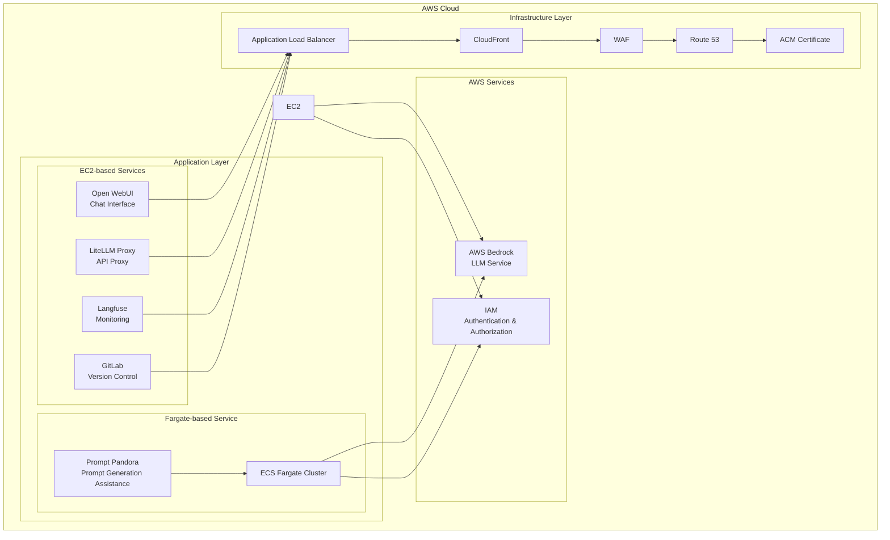

  

  
  
  

<h2 align="center">Enterprise-Grade Private AI Platform (v1.8.0)</h2>

>[!IMPORTANT]
>This repository leverages [SourceSage](https://github.com/Sunwood-ai-labs/SourceSage).  Approximately 90% of the release notes, README, and commit messages were generated using [SourceSage](https://github.com/Sunwood-ai-labs/SourceSage) and [claude.ai](https://claude.ai/).

>[!NOTE]
>AMATERASU is the successor project to [MOA](https://github.com/Sunwood-ai-labs/MOA).  It has evolved to run each AI service as an independent EC2 instance using Docker Compose, enabling easy deployment with Terraform.

## 🚀 Project Overview

AMATERASU is an enterprise-grade private AI platform. Built on AWS Bedrock and Google Vertex AI, it allows for the development and operation of LLM-based applications in a secure and scalable environment. Integration with GitLab streamlines version control, CI/CD pipelines, and project management.

## ✨ Key Features

### Secure Foundation
- Secure LLM foundation based on AWS Bedrock and Google Vertex AI
- Operation in a completely closed environment
- Enterprise-grade security

### Microservice Architecture
- Independent service components
- Container-based deployment
- Flexible scaling

### Infrastructure as Code
- Fully automated deployment using Terraform
- Environment-specific configuration management
- Version-controlled configuration

### GitLab Integration
- Enhanced version control, CI/CD pipelines, and project management features
- Integration with self-hosted GitLab instances
- LLM-powered merge request analysis
- Automated labeling using GitLab webhooks

## 🏗️ System Architecture

## 📦 Component Composition

### 1. Open WebUI (Frontend)
- Chat-based user interface
- Responsive design
- Prompt template management

### 2. LiteLLM (API Proxy)
- Unified access to Claude-3 series models
- Access to Google Vertex AI models
- API key management and rate limiting

### 3. Langfuse (Monitoring)
- Usage tracking
- Cost analysis
- Performance monitoring

### 4. GitLab (Version Control)
- Self-hosted GitLab instance
- Project and code management
- CI pipeline and Runner configuration
- Backup and restore functionality

### 5. FG-prompt-pandora (Fargate Sample Application)
- Auto-scaling on AWS Fargate
- Prompt generation using Claude-3.5-Sonnet
- Intuitive UI based on Streamlit

## 🆕 Latest News

### AMATERASU v1.8.0 (Latest Release)

- 🎉 **Enhanced Security with CloudFront and WAF**
  - Addition of CloudFront distribution
  - IP-based access control with WAF
  - Improved infrastructure security

- 🎉 **Improved Route53 and ACM Configuration**
  - Improved DNS record management
  - Automated SSL/TLS certificate management
  - Increased flexibility in domain settings

- 🚀 **Infrastructure Optimization**
  - Efficient content delivery via CloudFront
  - Flexible configuration options for WAF rulesets
  - Updated security group settings

[See release notes for further details]

## 📄 License

This project is licensed under the MIT License.

## 👏 Acknowledgements

Thanks to all contributors.