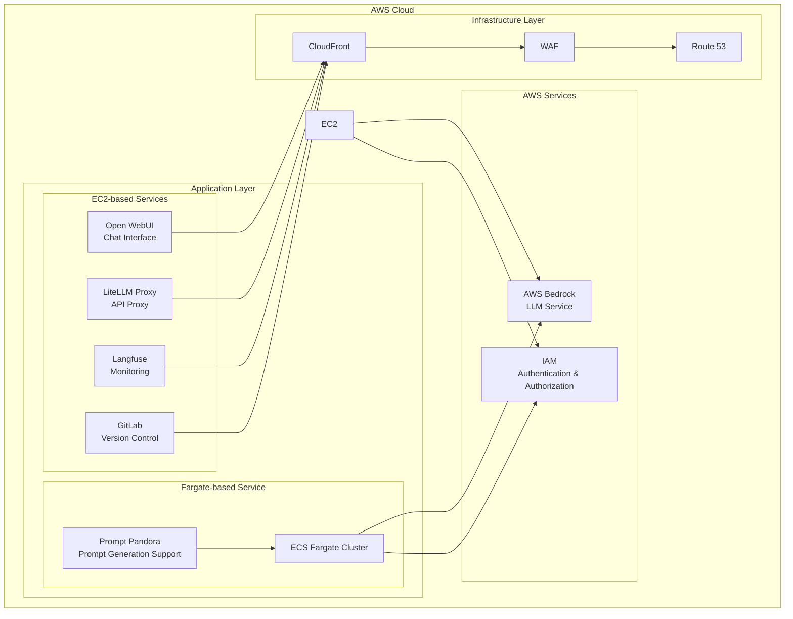

  

  
  
  

<h2 align="center">Enterprise-Grade Private AI Platform (v1.11.0)</h2>

>[!IMPORTANT]
>This repository leverages [SourceSage](https://github.com/Sunwood-ai-labs/SourceSage).  Approximately 90% of the release notes, README, and commit messages were generated using [SourceSage](https://github.com/Sunwood-ai-labs/SourceSage) and [claude.ai](https://claude.ai/).

>[!NOTE]
>AMATERASU is the successor project to [MOA](https://github.com/Sunwood-ai-labs/MOA).  It has been improved to run each AI service as an independent EC2 instance using Docker Compose, and deployment is simplified using Terraform.

## 🚀 Project Overview

AMATERASU is an enterprise-grade private AI platform.  Built on AWS Bedrock and Google Vertex AI, it allows you to develop and operate LLM-based applications in a secure and scalable environment.  Integration with GitLab streamlines version control, CI/CD pipelines, and project management.

## ✨ Key Features

### Secure Foundation
- Secure LLM foundation based on AWS Bedrock and Google Vertex AI
- Operation in a completely closed environment
- Enterprise-grade security

### Microservices Architecture
- Independent service components
- Container-based deployment
- Flexible scaling

### Infrastructure as Code
- Fully automated deployment with Terraform
- Environment-specific configuration management
- Version-controlled configuration

### GitLab Integration
- Enhanced version control, CI/CD pipelines, and project management features
- Integration with self-hosted GitLab instances
- LLM-powered merge request analysis
- Automated labeling using GitLab webhooks

## 🏗️ System Architecture

## 📦 Component Composition

### 1. Open WebUI (Frontend)
- Chat-based user interface
- Responsive design
- Prompt template management

### 2. LiteLLM (API Proxy)
- Unified access to Claude-3 series models
- Access to Google Vertex AI models
- API key management and rate limiting

### 3. Langfuse (Monitoring)
- Usage tracking
- Cost analysis
- Performance monitoring

### 4. GitLab (Version Control)
- Self-hosted GitLab instance
- Project and code management
- CI pipeline and Runner configuration
- Backup and restore functionality

### 5. FG-prompt-pandora (Fargate Sample Application)
- Auto-scaling on AWS Fargate
- Prompt generation using Claude-3.5-Sonnet
- Intuitive UI based on Streamlit

## 🆕 Latest Information

### AMATERASU v1.11.0 (Latest Release)

- 🎉 **IP Whitelist Configuration with WAFv2**: Implemented an IP whitelist feature to control access to CloudFront using AWS WAFv2.  IP addresses are read from the `whitelist-waf.csv` file, and an IP set is created using the `aws_wafv2_ip_set` resource.  By default, access is blocked, and only access from IP addresses registered in the whitelist is permitted. (commit: 57883b3)
- 🎉 **Creation of README.md for CloudFront Infrastructure Construction**: Added a README.md document describing the procedure for building the CloudFront infrastructure to run OpenWebUI on EC2.  This comprehensively explains CloudFront, WAFv2, and Route 53 configuration methods, prerequisites, setup procedures, output values, environment removal methods, precautions, and troubleshooting. (commit: b275845)
- 🎉 **Route 53 DNS Record Configuration**: Added a setting to automatically create alias records for the CloudFront distribution in Route 53. (commit: 105d6a6)
- 🎉 **Definition of CloudFront-Related Output Values**: Defined output values to obtain important information such as the domain name, ID, ARN, and URL of the CloudFront distribution. (commit: 27df674)
- 🎉 **Automation of ACM Certificate and DNS Verification**: Implemented automatic creation of ACM certificates used for CloudFront and DNS verification using Route 53. (commit: 6ad223a)
- 🎉 **Enhanced Security Group Configuration and Explicit AMI ID**: Changed the security group ID from a single ID to a list of multiple IDs. (commit: 5897676)
- 🎉 **Added Security Group ID Output**: Added an item to output the security group ID to `outputs.tf`. (commit: 6e97f07)
- 🎉 **Added Whitelist Sample CSV**: Added a sample CSV file for WAF whitelist configuration. (commit: 49dd8b4)
- 🚀 **Provider Configuration Integration**: Integrated `provider.tf` into `main.tf` to reduce the number of files. (commit: 7f9dfd6)
- 🚀 **Added Example tfvars File**: Added a `terraform.example.tfvars` file for setting environment variables. (commit: fc59dcd)
- 🐛 **Corrected Whitelist CSV Path in WAF Configuration**: Corrected the path to the whitelist CSV file referenced in the WAF configuration. (commit: f6254c4)
- ⚠️ **Significant Infrastructure Changes**: Improvements and refactoring of already implemented features have been made.  Please back up your existing infrastructure and configuration before upgrading.

## 🛠️ Usage

Refer to the README file for each component for usage instructions.

## 📦 Installation Instructions

1. Clone the repository.
2. Follow the instructions in each project's README to install dependencies and deploy the application.
3. Enter the necessary settings in the `terraform.tfvars` file.

## 📄 License

This project is licensed under the MIT License.

## 👏 Acknowledgements

Thanks to Maki and iris-s-coon for their contributions.