<p align="center">

<h1 align="center">🌄 AMATERASU v0.5.1 🌄</h1>
</p>

<p align="center">
  <a href="https://github.com/Sunwood-ai-labs/AMATERASU">
    
  </a>
  <a href="https://github.com/Sunwood-ai-labs/AMATERASU/releases">
    
  </a>
  <a href="https://github.com/Sunwood-ai-labs/AMATERASU/blob/main/LICENSE">
    
  </a>
  <a href="https://github.com/Sunwood-ai-labs/AMATERASU/stargazers">
    
  </a>
</p>

<h2 align="center">
  ～ Automating the Construction of an LLM Platform on AWS ～
</h2>

>[!IMPORTANT]
>This repository leverages [SourceSage](https://github.com/Sunwood-ai-labs/SourceSage).  Approximately 90% of the release notes, README, and commit messages were generated using [SourceSage](https://github.com/Sunwood-ai-labs/SourceSage) and [claude.ai](https://claude.ai/).

>[!NOTE]
>AMATERASU is the successor project to [MOA](https://github.com/Sunwood-ai-labs/MOA).  It has evolved to run each AI service on a separate EC2 instance using Docker Compose, making deployment with Terraform significantly easier.


## 🚀 Project Overview

AMATERASU is an automation tool for building Large Language Model (LLM) platforms on AWS.  Building upon the functionality of MOA, it provides more flexible scaling and management by running each service on an independent EC2 instance.

### Key Features:
- Simple EC2 instance management using Terraform
- Independent EC2 instances and Docker Compose environments for each service
- Service-level scaling and operation
- Secure communication and access control

## 🏗️ Architecture

### Architecture Overview

AMATERASU employs a three-tier architecture:

1. **Infrastructure Layer** (Spellbook)
   - AWS infrastructure base
   - Networking and security

2. **Platform Layer**
   - LLM proxy service (LiteLLM)
   - Monitoring infrastructure (Langfuse)

3. **Application Layer**
   - Web UI interface (Open WebUI)
   - API endpoints

### Infrastructure Diagram

```mermaid
%%{init:{'theme':'base'}}%%

graph TB
    subgraph AWS Cloud
        subgraph "Base Infrastructure"
            VPC["VPC<br/>(base-infrastructure)"]
            SG["Security Groups"]
            PUBSUB["Public Subnets"]
        end

        subgraph "Service Infrastructure"
            subgraph "OpenWebUI Service"
                ALB_UI["ALB"] --> UI_EC2["EC2<br/>Open WebUI"]
            end

            subgraph "Langfuse Service"
                ALB_LF["ALB"] --> LF_EC2["EC2<br/>Langfuse"]
            end

            subgraph "LiteLLM Service"
                ALB_LL["ALB"] --> LL_EC2["EC2<br/>LiteLLM"]
            end
        end
    end

    Users["Users 👥"] --> ALB_UI
    Users --> ALB_LF
    Users --> ALB_LL

    UI_EC2 --> ALB_LL
    LF_EC2 --> ALB_LL

    SG -.-> UI_EC2
    SG -.-> LF_EC2
    SG -.-> LL_EC2

```



## 📦 Installation Instructions

1. Clone the repository:
```bash
git clone https://github.com/Sunwood-ai-labs/AMATERASU.git
cd AMATERASU
```

2. Set environment variables:
```bash
cp .env.example .env
# Edit the .env file and configure the necessary credentials
```

3. Deploy the infrastructure:
```bash
cd spellbook/base-infrastructure
terraform init && terraform apply

cd ../open-webui/terraform/main-infrastructure
terraform init && terraform apply
```

4. Start the services:
```bash
# Deploy Langfuse
cd ../../langfuse
docker-compose up -d

# Deploy LiteLLM
cd ../litellm
docker-compose up -d

# Deploy Open WebUI
cd ../open-webui
docker-compose up -d
```

## 📚 Detailed Documentation

- [Spellbook Infrastructure Setup Guide](spellbook/README.md)
- [LiteLLM Configuration Guide](spellbook/litellm/README.md)
- [Langfuse Setup Guide](spellbook/langfuse/README.md)

## 🆕 What's New

### v0.5.1 Updates

- 🎉 Added AMATERASU architecture overview and diagram to README.md.
- 🚀 Significantly updated the Spellbook README.md.
- 🚀 Completely revised the README.md.
- 🚀 Updated the English README.


### v0.5.0 Updates

- 🎉 Added whitelist IP address configuration functionality.
- 🎉 Added Terraform variable file configuration functionality.
- 🎉 Added a setup script for after EC2 instance startup.
- 🎉 Added overall output configuration.
- 🎉 Major update to the VPC module.

## 📊 Resource Requirements

Minimum Configuration:
- EC2: t3.medium (2vCPU/4GB)
- Storage: 50GB gp2
- Network: Public subnet

Recommended Configuration:
- EC2: t3.large (2vCPU/8GB)
- Storage: 100GB gp2
- Network: Public/Private subnet

## 💰 Cost Management

Provides detailed cost analysis and management features through Langfuse:
- Model-specific usage cost tracking
- Budget alert settings
- Usage visualization

## 👏 Acknowledgements

Thanks to iris-s-coon and Maki for their contributions.

## 📄 License

This project is licensed under the MIT License.  See the [LICENSE](LICENSE) file for details.

## 🤝 Contributing

1. Fork this repository
2. Create a new branch (`git checkout -b feature/amazing-feature`)
3. Make your changes and commit (`git commit -m 'Add amazing feature'`)
4. Push your branch (`git push origin feature/amazing-feature`)
5. Create a pull request

## 📧 Support

For questions or feedback, please contact us:
- Create an issue: [GitHub Issues](https://github.com/Sunwood-ai-labs/AMATERASU/issues)
- Email: support@sunwoodai.com

Build a more flexible and powerful AI infrastructure with AMATERASU! ✨