<p align="center">

<h1 align="center">AMATERASU v0.6.1</h1>
</p>

<p align="center">
  <a href="https://github.com/Sunwood-ai-labs/AMATERASU">
    
  </a>
  <a href="https://github.com/Sunwood-ai-labs/AMATERASU/releases">
    
  </a>
  <a href="https://github.com/Sunwood-ai-labs/AMATERASU/blob/main/LICENSE">
    
  </a>
</p>

<h2 align="center">
  Enterprise-Grade Private AI Platform
</h2>

>[!IMPORTANT]
>This repository leverages [SourceSage](https://github.com/Sunwood-ai-labs/SourceSage).  Approximately 90% of the release notes, README, and commit messages are generated using [SourceSage](https://github.com/Sunwood-ai-labs/SourceSage) and [claude.ai](https://claude.ai/).

>[!NOTE]
>AMATERASU is the successor project to [MOA](https://github.com/Sunwood-ai-labs/MOA).  It has evolved to run each AI service in a separate EC2 instance using Docker Compose, enabling easy deployment with Terraform.

[Image Placeholder -  The link provided points to a user attachment and cannot be displayed here.]


## 🔒 Security-Focused Design Philosophy

AMATERASU is a private AI platform foundation developed specifically for Japanese enterprises with stringent security requirements. It enables the secure use of LLMs based on AWS Bedrock:

- **Secure LLM Foundation with AWS Bedrock**:
  - Supports the Claude-3 model, optimized for enterprise use.
  - Leverages AWS's enterprise-grade security.
  - Granular access control using IAM roles.

- **Operation in a Completely Closed Environment**:
  - Operates only within the internal network.
  - Supports private cloud/on-premises deployments.

- **Enterprise-Grade Security**:
  - IP whitelist access control.
  - HTTPS/TLS encrypted communication.
  - Network segmentation using AWS Security Groups.
  - IAM role management based on the principle of least privilege.

## ✨ Key Features

### 1. Secure ChatGPT-like Interface (Open WebUI)
- Provides an internal chat UI.
- Manages prompt templates.
- Saves and searches conversation history.

### 2. Secure API Proxy Server (LiteLLM)
- Secure LLM access based on AWS Bedrock.
- Integrated management of the Claude-3 series (Opus/Sonnet/Haiku).
- Load balancing and rate limiting of requests.
- Centralized API key management.

### 3. Cost Management and Monitoring Foundation (Langfuse)
- Visualizes token usage.
- Aggregates costs by department.
- Analyzes usage patterns.

## 🏗️ System Architecture

### Secure 3-Tier Architecture based on AWS Bedrock

```mermaid
%%{init:{'theme':'base'}}%%
graph TB
    subgraph "AWS Cloud"
        subgraph "Internal Network"
            subgraph "Presentation Layer"
                WebUI["Open WebUI<br/>(Chat Interface)"]
            end
            
            subgraph "Application Layer"
                LiteLLM["LiteLLM Proxy<br/>(API Management)"]
                Langfuse["Langfuse<br/>(Monitoring & Analysis)"]
            end
            
            subgraph "Infrastructure Layer"
                VPC["VPC/Security Groups"]
                IAM["IAM Role Management"]
            end
        end

        subgraph "AWS Bedrock"
            Claude3["Claude-3<br/>Models"]
        end
        
        WebUI --> LiteLLM
        WebUI --> Langfuse
        LiteLLM --> VPC
        Langfuse --> VPC
        VPC --> IAM
        LiteLLM --> Claude3
    end

    Users["Internal Users 👥"] --> WebUI
```




## 📊 Resource Requirements

Minimum Configuration:
- EC2: t3.medium (2vCPU/4GB)
- Storage: 50GB gp2
- Network: Public subnet

Recommended Configuration:
- EC2: t3.large (2vCPU/8GB)
- Storage: 100GB gp2
- Network: Public/Private subnet


## 💼 Use Cases in Enterprises

1. **Development Department**
   - Code review assistance
   - Improved bug analysis efficiency
   - Document generation

2. **Business Departments**
   - Report creation assistance
   - Data analysis support
   - Meeting minutes creation

3. **Customer Support**
   - Improved efficiency of inquiry response
   - Automatic FAQ generation
   - Improved quality of reply text


## 🔧 Installation and Operation

### Setup Procedure
```bash
# 1. Clone the repository
git clone https://github.com/Sunwood-ai-labs/AMATERASU.git
cd AMATERASU

# 2. Set environment variables
cp .env.example .env
# Edit the .env file and set credentials

# 3. Deploy infrastructure
cd spellbook/base-infrastructure
terraform init && terraform apply

cd ../open-webui/terraform/main-infrastructure
terraform init && terraform apply

# 4. Start services
# Langfuse (Monitoring foundation)
cd ../../langfuse
docker-compose up -d

# LiteLLM (API proxy)
cd ../litellm
docker-compose up -d

# Open WebUI (User interface)
cd ../open-webui
docker-compose up -d
```

## 📚 Detailed Documentation

- [Spellbook Infrastructure Construction Guide](spellbook/README.md)
- [LiteLLM Configuration Guide](spellbook/litellm/README.md)
- [Langfuse Setup Guide](spellbook/langfuse/README.md)

## 🆕 Latest Information

### v0.6.1 Update Notes

- Updated documentation and added important information to the README file.
- Updated English and Japanese READMEs.
- Added information about the development process using SourceSage and claude.ai.
- Simplified descriptions related to security.


### v0.6.0 Update Notes

- Removed unnecessary resources due to the removal of the CloudFront infrastructure.
- Simplified the code to improve maintainability.
- Added application HTTPS and HTTP URLs to the output.
- Enabled easy modification of the environment variable file and setup script paths in `terraform.tfvars`.
- Removed unnecessary variable definitions.
- Simplified the setup script.


## 💰 Cost Management

Provides detailed cost analysis and management functionality through Langfuse:
- Tracks usage costs for each model.
- Allows setting budget alerts.
- Visualizes usage.

## 👏 Acknowledgements

Thanks to iris-s-coon and Maki for their contributions.

## 📄 License

This project is licensed under the MIT License.  See the [LICENSE](LICENSE) file for details.

## 🤝 Contributions

1. Fork this repository
2. Create a new branch (`git checkout -b feature/amazing-feature`)
3. Commit your changes (`git commit -m 'Add amazing feature'`)
4. Push the branch (`git push origin feature/amazing-feature`)
5. Create a pull request

## 📧 Support

For questions or feedback, please feel free to contact us:
- Create an Issue: [GitHub Issues](https://github.com/Sunwood-ai-labs/AMATERASU/issues)
- Email: support@sunwoodai.com

---

Build a secure and efficient AI infrastructure with AMATERASU. ✨