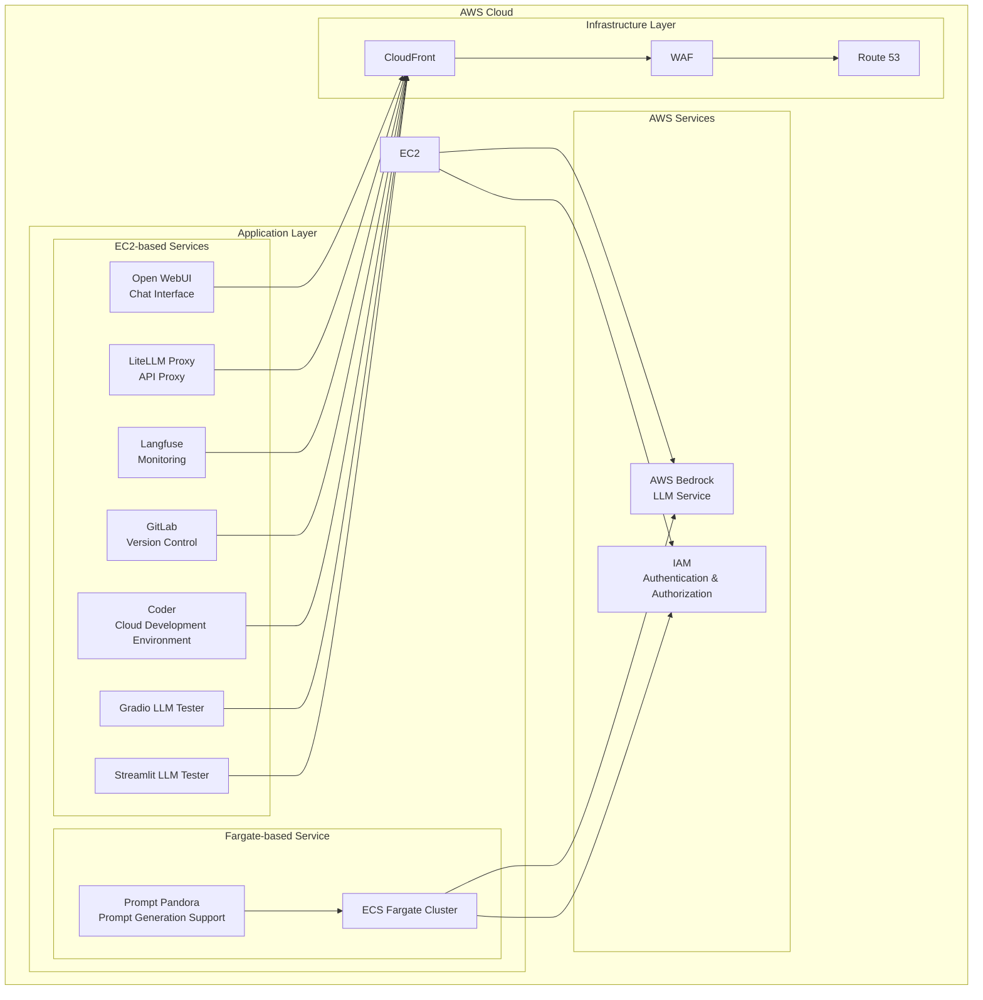

<p align="center">
  
</p>

<p align="center">
  <a href="https://github.com/Sunwood-ai-labs/AMATERASU"></a>
  <a href="https://github.com/Sunwood-ai-labs/AMATERASU/releases"></a>
  <a href="https://github.com/Sunwood-ai-labs/AMATERASU/blob/main/LICENSE"></a>
</p>

<h2 align="center">Enterprise-Grade Private AI Platform (v1.21.0)</h2>

>[!IMPORTANT]
>This repository leverages [SourceSage](https://github.com/Sunwood-ai-labs/SourceSage).  Approximately 90% of the release notes, README, and commit messages were generated using [SourceSage](https://github.com/Sunwood-ai-labs/SourceSage) and [claude.ai](https://claude.ai/).

>[!NOTE]
>AMATERASU is the successor project to [MOA](https://github.com/Sunwood-ai-labs/MOA).  It has evolved to run each AI service as an independent EC2 instance using Docker Compose, enabling easy deployment with Terraform.

## 🚀 Project Overview

AMATERASU is an enterprise-grade private AI platform. Built on AWS Bedrock and Google Vertex AI, it allows for the development and operation of LLM-powered applications in a secure and scalable environment.  Integration with GitLab streamlines version control, CI/CD pipelines, and project management. This repository is structured as a "spellbook" for managing multiple AI-related projects. Each project is organized as a separate folder for deploying and managing specific AI services or functionalities.


## ✨ Key Features

### Secure Foundation
- Secure LLM foundation based on AWS Bedrock and Google Vertex AI
- Operation in a completely closed environment
- Enterprise-grade security

### Microservices Architecture
- Independent service components
- Container-based deployment
- Flexible scaling

### Infrastructure as Code
- Fully automated deployment with Terraform
- Environment-specific configuration management
- Version-controlled configuration

### GitLab Integration
- Enhanced version control, CI/CD pipelines, and project management features
- Integration with self-hosted GitLab instances
- LLM-powered merge request analysis
- Automated labeling using GitLab webhooks

### Project Exploration Features
- Automatic detection of Terraform projects and generation of `terraform.tfvars` files
- Simplified configuration using the `amaterasu` command-line tool


## 🏗️ System Architecture



## 📦 Component Composition

### 1. Open WebUI (Frontend)
- Chat-based user interface
- Responsive design
- Prompt template management
    - [Details here](./spellbook/open-webui/README.md)

### 2. LiteLLM (API Proxy)
- Unified access to Claude-3 series models
- Access to Google Vertex AI models
- OpenRouter API integration
- API key management and rate limiting
    - [Details here](./spellbook/litellm/README.md)

### 3. Langfuse (Monitoring)
- Usage tracking
- Cost analysis
- Performance monitoring
    - [Details here](./spellbook/langfuse3/README.md)

### 4. GitLab (Version Control)
- Self-hosted GitLab instance
- Project and code management
- CI pipeline and Runner configuration
- Backup and restore functionality

### 5. FG-prompt-pandora (Fargate Sample Application)
- Auto-scaling on AWS Fargate
- Prompt generation using Claude-3.5-Sonnet
- Intuitive UI based on Streamlit
    - [Details here](./spellbook/fg-prompt-pandora/README.md)

### 6. Coder (Cloud Development Environment)
- Web-based IDE environment
- Support for VS Code extensions
- Secure development on AWS infrastructure
    - [Details here](./spellbook/Coder/README.md)

### 7. Dify (AI Application Development Platform)
- AI application development platform integrating various AI models
- UI/API-based development is possible
    - [Details here](./spellbook/dify/README.md)

### 8. Dify Beta (AI Application Development Platform)
- Beta version of Dify including new and experimental features
- Advanced configuration of vector databases and sandbox environments is possible
    - [Details here](./spellbook/dify-beta1/README.md)

### 9. Open WebUI Pipeline
- Pipeline functions to enhance integration with Open WebUI
- Filter processing such as conversation turn limits and Langfuse integration
    - [Details here](./spellbook/open-webui-pipeline/README.md)

### 10. Amaterasu Tool (Terraform Variable Generator)
- Automates the generation of `terraform.tfvars` files using a command-line tool
- Generates configuration values for each project in the spellbook
- [Details here](./spellbook/amaterasu-tool-ui/README.md)

### 11. Kotaemon (Document and Chat RAG UI Tool)
- RAG UI tool for document and chat
- Provides a Docker environment and Terraform configuration
- Data persistence and customizable environment settings
- Secure authentication system implemented
    - [Details here](./spellbook/kotaemon/README.md)

### 12. Bolt DIY (AI Chat Interface)
- State-of-the-art AI chat interface
- Supports multiple AI providers (OpenAI, Anthropic, Google, etc.)
- Provides a Docker-containerized environment
- CloudFront infrastructure configuration
    - [Details here](./spellbook/bolt-diy/README.md)

### 13. LLM Tester (Gradio Version)
- Gradio-based LLM proxy connection tester
- Various parameter settings and debug information display
    - [Details here](./spellbook/ee-llm-tester-gr/README.md)

### 14. LLM Tester (Streamlit Version)
- Streamlit-based LLM proxy connection tester
- Various parameter settings and debug information display
    - [Details here](./spellbook/ee-llm-tester-st/README.md)


## 🔧 Usage

Refer to the respective README files for instructions on using each component.  For instructions on using the `amaterasu` command-line tool, refer to `spellbook/amaterasu-tool-ui/README.md`.


## 📦 Installation Instructions

1. Clone the repository.
```bash
git clone https://github.com/Sunwood-ai-labs/AMATERASU.git
cd AMATERASU
```
2. Follow the instructions in each project's README to install dependencies and deploy the application.
3. Enter the necessary settings in the `terraform.tfvars` file. You can also use the `amaterasu` tool to generate it automatically.


## 📦 Dependencies

The root directory of this repository contains a `requirements.txt` file defining common dependencies.
```bash
pip install -r requirements.txt
```

```plaintext
aira
sourcesage
```

## 📄 License

This project is licensed under the MIT License.

## 👏 Acknowledgements

Thanks to iris-s-coon and Maki for their contributions.

## 🆕 What's New

### AMATERASU v1.21.0 (Latest Release)


- **Expanded LLM Tester Functionality**: Added two types of interfaces based on Gradio and Streamlit.  IP address information and detailed debug information can now be displayed.
- **Enhanced LiteLLM Functionality**: Integrated OpenRouter API and standardized model names.
- **Infrastructure Improvements**: Optimized Docker environment, strengthened inter-container communication, and updated the NextAuth URL setting for Langfuse3.
- **Added New Presentation Tool**: Added Marp Editable UI. Provides a containerized Markdown presentation editing environment.
- **Enhanced Security**: Improved WAF settings, CSV file management for IP whitelists, and flexible security rule settings.
- **Improved Configuration Management**: Added `.env.example` files for each component to standardize and document configuration files.

- 📝 Notes:
    - Existing configuration files need to be updated due to changes in LiteLLM settings.
    - The WAF IP whitelist needs to be migrated to the new CSV format.
    - Check the environment variable settings and update as needed.