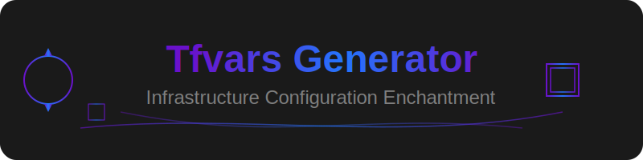

# 🎮 Amaterasu Tool UI



AWSインフラストラクチャ設定を管理するためのWebインターフェース

## 🌟 特徴

- ✨ 直感的なWeb UIによるTerraform設定管理
- 🚀 terraform.tfvarsファイルの自動生成
- 🔧 CloudFrontインフラストラクチャの設定
- 🧹 Terraformキャッシュの効率的な管理
- 🎯 プロジェクト設定の一元管理

## 📚 ドキュメント

詳細な情報は以下のドキュメントを参照してください：

- [🚀 インストールガイド](docs/installation.md)
  - 環境構築
  - 依存関係のインストール
  - トラブルシューティング

- [📚 使用方法ガイド](docs/usage.md)
  - アプリケーションの起動方法
  - 基本的な操作フロー
  - 各機能の詳細な使い方

- [👨‍💻 開発者ガイド](docs/development.md)
  - プロジェクト構造
  - 開発環境のセットアップ
  - テストと品質管理
  - コーディング規約

## 🚀 クイックスタート

```bash
# 1. 仮想環境の作成と有効化
python -m venv .venv
source .venv/bin/activate  # Windows: .venv\Scripts\activate

# 2. 依存パッケージのインストール
uv pip install -r requirements.txt

# 3. amaterasu-toolのインストール
uv pip install -e .

# 4. アプリケーションの起動
PYTHONPATH=/path/to/amaterasu-tool-ui python amaterasu_tool_ui/app.py
```

## 🖥️ 動作環境

- Python 3.9以上
- OS: Linux, macOS, Windows
- 必要なパッケージ:
  - gradio>=4.0.0
  - pydantic>=2.5.0
  - python-dotenv>=1.0.0

## 🤝 コントリビューション

1. このリポジトリをフォーク
2. フィーチャーブランチを作成（`git checkout -b feature/amazing-feature`）
3. 変更をコミット（`git commit -m '✨ Add some amazing feature'`）
4. ブランチにプッシュ（`git push origin feature/amazing-feature`）
5. プルリクエストを作成

詳細な開発ガイドラインは[開発者ガイド](docs/development.md)を参照してください。

## ⚠️ 注意事項

- プロダクション環境で使用する前に十分なテストを行ってください
- 設定変更前には必ずバックアップを作成してください
- output.jsonが存在しない場合はデフォルト値が使用されます

## 📄 ライセンス

このプロジェクトはMITライセンスで提供されています。

## 🙏 謝辞

- [Gradio](https://gradio.app/)
- [Pydantic](https://pydantic-docs.helpmanual.io/)
- すべてのコントリビューターの皆様

## 📞 サポート

- Issue Trackerで問題を報告: [Issues](https://github.com/yourusername/amaterasu-tool-ui/issues)
- プロジェクトのwiki: [Wiki](https://github.com/yourusername/amaterasu-tool-ui/wiki)

---

Made with ❤️ by Amaterasu Team
