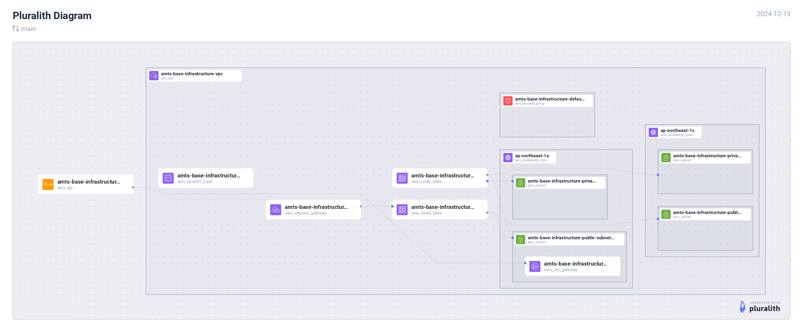

<div align=\"center\">


# Base Infrastructure Module

AMATERASUプロジェクトの基盤となるAWSインフラストラクチャを管理します。

</div>

## 🌟 概要

このモジュールは、以下のコアインフラストラクチャコンポーネントを提供します：

- VPC設定とネットワーキング
- セキュリティグループ管理
- Route53プライベートホストゾーン
- IPホワイトリスト管理

## 🏗️ アーキテクチャ



## 📦 モジュール構成

### VPC Module (`modules/vpc/`)
- VPCとサブネット設定
- インターネットゲートウェイ
- NATゲートウェイ
- ルートテーブル設定

### Security Module (`modules/security/`)
- セキュリティグループ管理
- ホワイトリストIPアドレス制御
- ネットワークACL設定

### Route53 Module (`modules/route53/`)
- プライベートホストゾーン管理
- DNSレコード設定

## 🚀 デプロイメント手順

1. 環境変数の設定
```bash
# AWS認証情報の設定
export AWS_ACCESS_KEY_ID=\"your-access-key\"
export AWS_SECRET_ACCESS_KEY=\"your-secret-key\"
export AWS_DEFAULT_REGION=\"ap-northeast-1\"
```

2. `terraform.tfvars`の設定
```hcl
aws_region   = \"ap-northeast-1\"
project_name = \"amts-base-infrastructure\"
environment  = \"dev\"
vpc_cidr     = \"10.0.0.0/16\"
```

3. ホワイトリストIPの設定
```bash
# whitelist.csvの編集
cp whitelist.example.csv whitelist.csv
```

4. インフラストラクチャのデプロイ
```bash
terraform init
terraform plan
terraform apply
```

## 📝 設定パラメータ

| パラメータ名 | 説明 | デフォルト値 |
|------------|------|------------|
| aws_region | AWSリージョン | ap-northeast-1 |
| project_name | プロジェクト名 | - |
| environment | 環境名（dev/stg/prod） | - |
| vpc_cidr | VPC CIDRブロック | 10.0.0.0/16 |
| public_subnet_cidrs | パブリックサブネットCIDR | [\"10.0.1.0/24\", \"10.0.2.0/24\"] |
| private_subnet_cidrs | プライベートサブネットCIDR | [\"10.0.10.0/24\", \"10.0.11.0/24\"] |

## 🔒 セキュリティ設定

### デフォルトセキュリティグループルール
- インバウンド：
  - SSH (22): ホワイトリストIPのみ
  - HTTP (80): ホワイトリストIPのみ
  - HTTPS (443): ホワイトリストIPのみ
  - その他のポート: VPC内部通信のみ許可
- アウトバウンド：
  - すべての通信を許可

### ホワイトリスト管理
- `whitelist.csv`でIPアドレスを管理
- 形式: `ip,description`
- 例: `203.0.113.0/24,Office Network`

## 📤 出力値

| 出力名 | 説明 |
|--------|------|
| vpc_id | 作成されたVPCのID |
| public_subnet_ids | パブリックサブネットのID |
| private_subnet_ids | プライベートサブネットのID |
| default_security_group_id | デフォルトセキュリティグループのID |
| route53_zone_id | Route53プライベートホストゾーンのID |

## 🔄 VPC構成

### パブリックサブネット
- AZ-a: 10.0.1.0/24
- AZ-c: 10.0.2.0/24
- インターネットゲートウェイ経由で外部接続

### プライベートサブネット
- AZ-a: 10.0.10.0/24
- AZ-c: 10.0.11.0/24
- NATゲートウェイ経由で外部接続

## ⚠️ 注意事項

1. 本番環境へのデプロイ前の確認事項：
   - セキュリティグループの設定
   - ホワイトリストIPの確認
   - サブネットCIDRの重複確認

2. コスト最適化：
   - NATゲートウェイの使用状況確認
   - 未使用のEIPの解放

3. バックアップと復旧：
   - 定期的な設定のエクスポート
   - Terraformステートファイルの管理

## 📝 ライセンス

このプロジェクトはMITライセンスの下で公開されています。詳細は[LICENSE](LICENSE)ファイルを参照してください。
