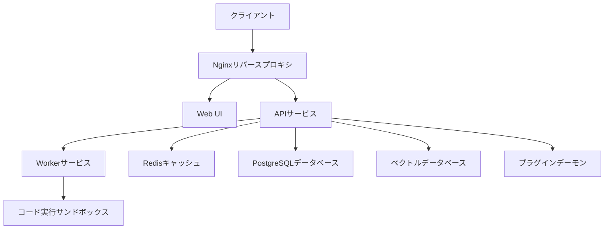

<p align="center">
  
</p>

<h1 align="center">🌟 AMATERASU Spellbook - Difyサービス</h1>

<p align="center">
  
  
  
  
  
  
  
</p>

<p align="center">
本リポジトリはAMATERASU Spellbookの一部として、Difyサービスのデプロイメント構成を提供します。
</p>

## 📋 目次

- [📋 目次](#-目次)
- [🎯 概要](#-概要)
- [🏗 システムアーキテクチャ](#-システムアーキテクチャ)
- [✨ 前提条件](#-前提条件)
- [🚀 セットアップ方法](#-セットアップ方法)
- [🔧 サービスコンポーネント](#-サービスコンポーネント)
- [⚙️ 環境設定](#️-環境設定)
- [👨‍💼 管理と運用](#-管理と運用)
  - [サービス管理](#サービス管理)
  - [データバックアップ](#データバックアップ)
- [🔍 トラブルシューティング](#-トラブルシューティング)
- [📝 ライセンス](#-ライセンス)
- [🤝 コントリビューション](#-コントリビューション)

## 🎯 概要

本プロジェクトはDifyサービスを効率的にデプロイ・運用するためのDocker Compose構成を提供します。以下の特徴があります：

- 🐳 Docker Composeベースの一貫したデプロイメント
- 🔒 SSL/TLS対応（Certbot統合）
- 🔄 ベクトルデータベース複数対応
- 🛡️ SSRFプロテクション
- 🔌 プラグインシステム対応
- 📦 コード実行サンドボックス環境

## 🏗 システムアーキテクチャ 

本システムは以下のコンポーネントで構成されています：



## ✨ 前提条件

- Docker Engine 24.0.0以上
- Docker Compose 2.20.0以上
- 最小システム要件:
  - CPU: 2コア以上
  - メモリ: 4GB以上
  - ディスク: 20GB以上の空き容量

## 🚀 セットアップ方法

1. 環境ファイルの準備:
```bash
cp .env.example .env
```

2. 環境変数の設定:
```bash
# .envファイルを編集して必要な設定を行う
vim .env
```

3. サービスの起動:
```bash
# 基本サービスの起動
docker compose up -d

# SSL証明書の取得（オプション）
docker compose --profile certbot up -d
docker compose exec certbot /bin/sh /update-cert.sh
```

## 🔧 サービスコンポーネント

- **API & Worker**: アプリケーションのバックエンドサービス
- **Web UI**: React/Next.jsベースのフロントエンド
- **PostgreSQL**: メインデータベース 
- **Redis**: キャッシュとメッセージブローカー
- **Vector Store**: ベクトルデータベース（Weaviate, Qdrant等）
- **Nginx**: リバースプロキシとSSL終端
- **Sandbox**: コード実行環境
- **Plugin Daemon**: プラグインシステム管理

## ⚙️ 環境設定

主要な設定ファイル：

- `.env`: メインの環境設定
- `docker-compose.yaml`: サービス構成
- `nginx/conf.d/`: Nginx設定
- `.env.example`: 設定例とドキュメント

## 👨‍💼 管理と運用

### サービス管理

```bash
# サービスの状態確認
docker compose ps

# ログの確認
docker compose logs -f [service_name]

# サービスの再起動
docker compose restart [service_name]
```

### データバックアップ

```bash
# PostgreSQLバックアップ
docker compose exec db pg_dump -U postgres dify > backup.sql

# ボリュームのバックアップ
tar -czvf volumes_backup.tar.gz ./volumes/
```

## 🔍 トラブルシューティング

よくある問題と解決方法：

1. **Nginxが起動しない**:
   - 設定ファイルの文法を確認
   - ポートの競合を確認
   - SSL証明書の存在を確認

2. **ベクトルDBへの接続エラー**:
   - 環境変数の設定を確認
   - ネットワーク接続を確認
   - メモリ使用量を確認

3. **APIエラー**:
   - ログを確認
   - 環境変数を確認
   - データベース接続を確認

---

## 📝 ライセンス

本プロジェクトは[MITライセンス](LICENSE)の下で公開されています。

## 🤝 コントリビューション

問題の報告やプルリクエストを歓迎します。大きな変更を行う場合は、まずIssueで提案してください。
