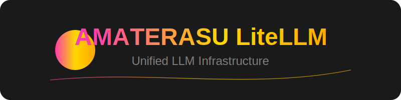

<div align="center">



多様なLLMプロバイダーを統一的に扱うためのインフラストラクチャ管理ツールです。[LiteLLM](https://github.com/BerriAI/litellm)をベースに、AWS Bedrock、Anthropic Claude、OpenAI、Google Geminiなど、様々なLLMサービスを一元管理できます。

</div>

## 🌟 主な機能

### 統一APIインターフェース
- **マルチプロバイダー対応**
  - AWS Bedrock (Claude-3シリーズ)
  - Anthropic Direct API (Claude-3、Claude-2.1)
  - OpenAI (GPT-4/3.5)
  - Google Gemini (Pro/Ultra)
  - DeepSeek
  - その他多数のプロバイダー

### インフラストラクチャ管理
- **コンテナ管理**
  - Docker Composeによる簡単なデプロイ
  - スケーラブルなマイクロサービスアーキテクチャ
- **モニタリング**
  - Prometheusによるメトリクス収集
  - 使用状況とパフォーマンスの監視
- **永続化**
  - PostgreSQLによるデータ管理
  - 設定とログの永続化

### セキュリティ機能
- **エッジプロテクション**
  - CloudFrontによるコンテンツ配信
  - WAFv2によるIPフィルタリング
- **内部通信**
  - プライベートDNSによるサービス間通信
  - VPC内での安全な通信経路
- **アクセス制御**
  - API認証とキー管理
  - トークン使用量の制限と監視

## 🚀 クイックスタート

### 1. 環境設定

1. 環境変数とAPIキーの設定：
```bash
cp .env.example .env

# 必須設定
LITELLM_MASTER_KEY="your-master-key"    # API認証用
LITELLM_SALT_KEY="your-salt-key"        # トークン暗号化用

# プロバイダー別APIキー
OPENAI_API_KEY="sk-..."                 # OpenAI用
ANTHROPIC_API_KEY="sk-ant-..."          # Anthropic用
GEMINI_API_KEY="AI..."                  # Google Gemini用
DEEPSEEK_API_KEY="sk-..."              # DeepSeek用

# AWS認証情報
AWS_ACCESS_KEY_ID="AKIA..."
AWS_SECRET_ACCESS_KEY="..."
AWS_DEFAULT_REGION="ap-northeast-1"

# Vertex AI設定
GOOGLE_APPLICATION_CREDENTIALS="/app/vertex-ai-key.json"
GOOGLE_PROJECT_ID="your-project-id"
```

2. モデル設定 (`config.yaml`)：
```yaml
model_list:
  - model_name: bedrock/claude-3-5-sonnet
    litellm_params:
      model: bedrock/anthropic.claude-3-5-sonnet-20240620-v1:0
      aws_region_name: us-east-1

  - model_name: Vertex_AI/gemini-pro
    litellm_params:
      model: vertex_ai/gemini-pro
      vertex_project: "os.environ/GOOGLE_PROJECT_ID"
      vertex_location: "us-central1"
```

### 2. インフラストラクチャのデプロイ

```bash
cd terraform/main-infrastructure
terraform init
terraform apply
```

### 3. サービスの起動

```bash
docker-compose up -d
```

## 🧪 テストツール

```plaintext
script/
├─ test_bedrock.py        # Bedrockモデル検証
├─ test_vertex_ai.py      # Vertex AI機能確認
├─ test_embeddings.py     # 埋め込みモデル評価
├─ test_simple_chat.py    # 基本的なチャット機能
├─ check_json_support.py  # JSON応答サポート確認
└─ check_model_params.py  # モデルパラメータ検証
```

## 🔍 動作確認

### 接続テスト
内部通信の確認：
```bash
python scripts/connectivity_health_check.py
```

### API動作確認
```bash
# シンプルなチャットリクエスト
curl -X POST "https://<your-domain>/v1/chat/completions" \
  -H "Authorization: Bearer ${LITELLM_MASTER_KEY}" \
  -H "Content-Type: application/json" \
  -d '{
    "model": "bedrock/claude-3-5-sonnet",
    "messages": [{"role": "user", "content": "Hello!"}]
  }'
```

## ⚙️ 設定カスタマイズ

### 基本設定
- ポート番号: `LITELLM_PORT`（デフォルト: 4000）
- データベースURL: `DATABASE_URL`
- モデル設定: `config.yaml`

### セキュリティ設定
- WAFルール: `whitelist-waf.example.csv`
- セキュリティグループ: `terraform.tfvars`
- 内部通信設定: プライベートDNS名

## 📝 トラブルシューティング

1. API接続エラー
   - APIキーの確認
   - ネットワーク設定の確認
   - WAFルールの確認

2. モデルエラー
   - `config.yaml`の設定確認
   - プロバイダーの稼働状態確認
   - クォータ制限の確認

3. 内部通信エラー
   - DNS設定の確認
   - セキュリティグループの確認
   - VPCエンドポイントの確認

## 📄 ライセンス

このプロジェクトはMITライセンスの下で公開されています。
