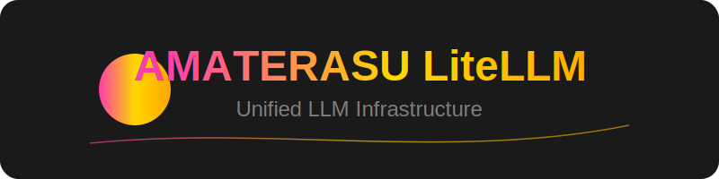

<div align="center">



多様なLLMプロバイダーを統一的に扱うためのインフラストラクチャ管理ツールです。[LiteLLM](https://github.com/BerriAI/litellm)をベースに、AWS Bedrock、Anthropic Claude、OpenAI、Google Geminiなど、様々なLLMサービスを一元管理できます。

</div>

## 🌟 主な機能

- **統一されたAPI**: 異なるLLMプロバイダーに対して一貫したインターフェースを提供
- **マルチプロバイダー対応**: 
  - AWS Bedrock (Claude 3系)
  - Anthropic Direct API
  - OpenAI
  - Google Gemini
  - その他多数のプロバイダーをサポート
- **インフラ管理**: 
  - Docker Composeによる簡単なデプロイ
  - Prometheusによるメトリクス監視
  - PostgreSQLによるデータ永続化

## 🚀 クイックスタート

### 環境設定

1. 必要な環境変数を`.env`ファイルに設定：
```bash
cp .env.example .env
# .envファイルを編集
```

2. `config.yaml`でモデル設定を行う：
```yaml
model_list:
  - model_name: bedrock/claude-3-5-sonnet
    litellm_params:
      model: bedrock/anthropic.claude-3-5-sonnet-20240620-v1:0
      aws_region_name: us-east-1

  - model_name: Vertex_AI/gemini-pro
    litellm_params:
      model: vertex_ai/gemini-pro
      vertex_project: "os.environ/GOOGLE_PROJECT_ID"
      vertex_location: "us-central1"
```

### 🐳 Dockerを使用した起動

```bash
docker-compose up -d
```

## 🧪 テストツール

```plaintext
script/
├─ test_bedrock.py        # Bedrockモデルのテスト
├─ test_vertex_ai.py      # Vertex AIモデルのテスト
├─ test_embeddings.py     # 埋め込みモデルのテスト
└─ test_simple_chat.py    # シンプルなチャットテスト
```

詳細については、[スクリプトディレクトリのREADME](./script/README.md)を参照してください。

## 🔒 セキュリティ機能

- CloudFrontによるアクセス制御
- WAFによるIPフィルタリング
- SSL/TLS暗号化
- セキュアなAPI認証
- トークン使用量の制限と監視

## 📝 ライセンス

このプロジェクトはMITライセンスの下で公開されています。
