<div align="center">



# Terraform Infrastructure

Comprehensive AWS infrastructure setup for Open WebUI deployment

</div>

## 📁 インフラストラクチャ構成

本プロジェクトは以下の2つの主要なインフラストラクチャモジュールで構成されています：

1. [Main Infrastructure](./main-infrastructure/README.md)
   - EC2インスタンス管理
   - VPCネットワーキング
   - ALBロードバランシング
   - Route53 DNS管理
   - IAMセキュリティ設定

2. [CloudFront Infrastructure](./cloudfront-infrastructure/README.md)
   - CloudFrontディストリビューション
   - WAFv2セキュリティ設定
   - オリジンアクセス設定

各モジュールの詳細な設定と使用方法については、それぞれのREADMEを参照してください。

## 🚀 デプロイメントフロー

1. Main Infrastructureのデプロイ
```bash
cd main-infrastructure
terraform init
terraform plan
terraform apply
```

2. CloudFront Infrastructureのデプロイ
```bash
cd ../cloudfront-infrastructure
terraform init
terraform plan
terraform apply
```

3. インフラストラクチャの削除（必要な場合）
```bash
terraform destroy
```

## 📝 設定管理

- 環境固有の設定は`terraform.tfvars`で管理
- 共通変数は`common_variables.tf`で定義
- モジュール固有の設定は各モジュールの`variables.tf`で定義

## ⚠️ 注意事項

インフラストラクチャをデプロイする前に以下を確認してください：

1. AWS認証情報が正しく設定されていること
2. 必要なIAM権限が付与されていること
3. リソース制限と予算を確認すること

詳細な注意事項については各モジュールのドキュメントを参照してください。