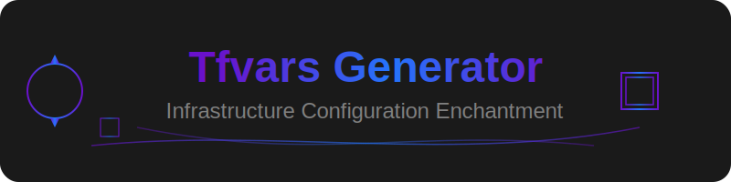

<p align="center">
  

  # 🎮 Terraform Variables Generator
</p>

## 🌟 概要

`terraform.tfvars`ファイルを自動生成するためのWebツールです。`main-infrastructure`ディレクトリを持つプロジェクトを自動検出し、共通設定の一括生成を実現します。

## ✨ 特徴

### 🔍 主な機能

- プロジェクトの自動検出
- 共通設定の一括生成
  - セキュリティグループID
  - サブネットID
  - VPC設定
  - Route53ゾーン情報
- プロジェクトごとの個別設定
  - サブドメイン
  - プロジェクト名
  - インスタンスタイプ
  - AMI ID
  - キーペア名

### 🎨 UIデザイン

洗練されたグラデーションを活用したモダンなデザインを採用しています。

#### カラーパレット

```css
--bg-light: #FAF6EA    /* 明るいベージュ */
--bg-medium: #DBD3BE   /* ミディアムベージュ */
--accent-light: #C99F75 /* キャメル */
--accent-dark: #906B65  /* ブラウン */
--text-color: #463F44  /* ダークグレー */
```

#### デザインの特徴

1. 洗練されたグラデーション表現
   - 背景: 明るいベージュから落ち着いたベージュへ
   - アクセント: キャメルからブラウンへの深みのある変化
   - テキスト: ダークグレーによる高いコントラスト

2. インタラクティブな要素
   - ボタン: グラデーションの反転によるホバーエフェクト
   - リンク: アンダーラインのグラデーションアニメーション
   - スクロールバー: カスタムデザインとグラデーション効果

3. UI要素の統一感
   - 一貫したカラーパレットの使用
   - 適切な余白とラウンド処理
   - フォントウェイトの最適化

## 🚀 使用方法

1. 必要なパッケージのインストール:
```bash
pip install -r requirements.txt
```

2. アプリケーションの起動:
```bash
streamlit run app.py
```

3. ブラウザで表示されるUIから:
   - 自動検出されたプロジェクトを確認
   - 共通ドメイン名を設定
   - 各プロジェクトの個別設定を行う
   - 生成ボタンをクリック

## 📁 ディレクトリ構造

```
tfvars_generator/
├── assets/
│   └── header.svg         # ヘッダー画像
├── config/
│   ├── project_values.py  # プロジェクト固有の設定管理
│   └── terraform_values.py # Terraform共通設定管理
├── utils/
│   ├── file_operations.py    # ファイル操作ユーティリティ
│   ├── project_discovery.py  # プロジェクト探索機能
│   └── ui_components/        # UIコンポーネント
│       ├── page.py          # ページ設定とヘッダー
│       ├── project_list.py  # プロジェクト一覧表示
│       ├── input_form.py    # 入力フォーム
│       └── progress.py      # 進捗表示
├── app.py                    # メインアプリケーション
└── requirements.txt          # 依存パッケージ
```

## 🛠️ 依存パッケージ

```
streamlit==1.29.0
